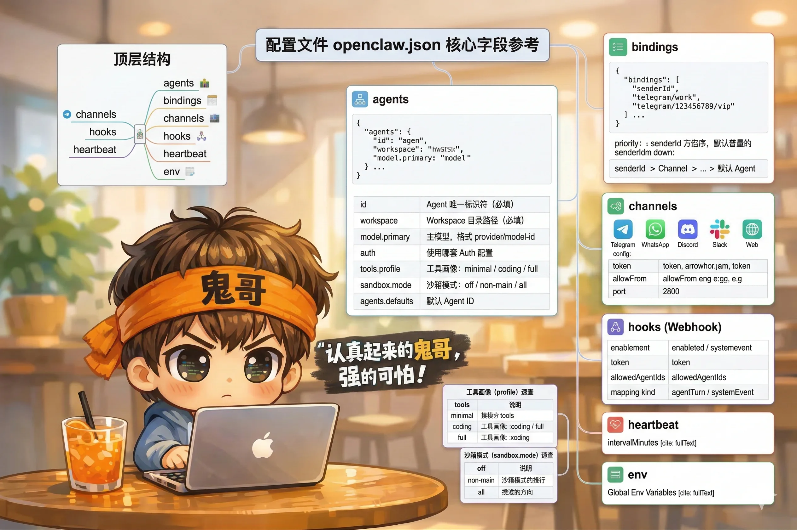

# 附录 B：配置文件 openclaw.json 核心字段参考



`openclaw.json` 是 Gateway 的主配置文件，默认位于 `~/.openclaw/openclaw.json`。

---

## 顶层结构

```json
{
  "agents": { ... },
  "bindings": [ ... ],
  "channels": { ... },
  "hooks": { ... },
  "heartbeat": { ... },
  "env": { ... }
}
```

---

## agents

```json
{
  "agents": {
    "list": [
      {
        "id": "main",
        "workspace": "~/.openclaw/workspace",
        "model": {
          "primary": "anthropic/claude-sonnet-4-6",
          "fallback": "openai/gpt-4o"
        },
        "auth": "default",
        "tools": {
          "profile": "coding",
          "allow": ["browser"],
          "deny": ["messaging"]
        },
        "sandbox": {
          "mode": "non-main"
        },
        "env": {
          "MY_VAR": "value"
        }
      }
    ],
    "defaults": "main"
  }
}
```

| 字段 | 类型 | 说明 |
|---|---|---|
| `id` | string | Agent 唯一标识符（必填） |
| `workspace` | string | Workspace 目录路径（必填） |
| `model.primary` | string | 主模型，格式 `provider/model-id` |
| `model.fallback` | string | 主模型不可用时的备用模型 |
| `auth` | string | 使用哪套 Auth 配置（对应 `auths` 字段） |
| `tools.profile` | string | 工具画像：`minimal` / `coding` / `full` |
| `tools.allow` | array | 在 profile 基础上额外启用的工具 |
| `tools.deny` | array | 在 profile 基础上额外禁用的工具 |
| `sandbox.mode` | string | 沙箱模式：`off` / `non-main` / `all` |
| `env` | object | Agent 专属环境变量 |
| `agents.defaults` | string | 没有匹配 binding 时使用的默认 Agent ID |

---

## bindings

```json
{
  "bindings": [
    {
      "channel": "telegram",
      "agentId": "work"
    },
    {
      "channel": "whatsapp",
      "accountId": "wa-personal",
      "agentId": "life"
    },
    {
      "channel": "telegram",
      "senderId": "123456789",
      "agentId": "vip"
    }
  ]
}
```

| 字段 | 类型 | 说明 |
|---|---|---|
| `channel` | string | 渠道名称（必填） |
| `agentId` | string | 目标 Agent ID（必填） |
| `accountId` | string | 渠道账号 ID（同渠道多账号时区分） |
| `senderId` | string | 精确匹配某个发送者 ID（优先级最高） |
| `guildId` | string | Discord 服务器 ID |
| `teamId` | string | Slack 工作区 ID |

**路由优先级**（高到低）：`senderId` > 父级 peer > `guildId+role` > `guildId` > `teamId` > `accountId` > `channel` > 默认 Agent

---

## channels

各渠道的连接配置，以下为常用渠道示例：

```json
{
  "channels": {
    "telegram": {
      "token": "your-bot-token"
    },
    "whatsapp": {
      "allowFrom": ["+8613800138000", "+8613900139000"]
    },
    "discord": {
      "token": "your-discord-token",
      "guildId": "your-guild-id"
    },
    "slack": {
      "botToken": "xoxb-...",
      "signingSecret": "..."
    },
    "web": {
      "enabled": true,
      "port": 18788
    }
  }
}
```

---

## hooks（Webhook）

```json
{
  "hooks": {
    "enabled": true,
    "token": "your-secret-token",
    "allowedAgentIds": ["main", "assistant"],
    "mappings": {
      "github-pr": {
        "kind": "agentTurn",
        "message": "GitHub 有新的 PR 需要 review",
        "channel": "telegram",
        "agentId": "work"
      }
    }
  }
}
```

| 字段 | 类型 | 说明 |
|---|---|---|
| `enabled` | boolean | 是否启用 Webhook 端点 |
| `token` | string | 认证 Token（必填） |
| `allowedAgentIds` | array | 允许通过 Webhook 触发的 Agent ID 列表 |
| `mappings` | object | 自定义路径到处理逻辑的映射 |
| `mappings[name].kind` | string | 处理类型：`agentTurn`（隔离会话）/ `systemEvent`（注入心跳队列） |
| `mappings[name].messageTemplate` | string | 支持 `{{变量名}}` 替换 payload 字段 |

---

## heartbeat

```json
{
  "heartbeat": {
    "intervalMinutes": 30
  }
}
```

| 字段 | 类型 | 默认值 | 说明 |
|---|---|---|---|
| `intervalMinutes` | number | `30` | 心跳间隔（分钟） |

---

## env

Gateway 全局环境变量，所有 Agent 均可访问：

```json
{
  "env": {
    "HA_TOKEN": "your-home-assistant-token",
    "HA_URL": "http://homeassistant.local:8123"
  }
}
```

Agent 级别的 `env` 字段仅该 Agent 可见，会覆盖同名的全局 `env`。

---

## 工具画像（profile）速查

| Profile | 包含工具组 |
|---|---|
| `minimal` | runtime（只读）、memory、sessions |
| `coding` | runtime（读写）、fs、web、exec、memory、sessions |
| `full` | 所有工具组，包含 browser、messaging、nodes、automation |

---

## 沙箱模式（sandbox.mode）速查

| Mode | 行为 |
|---|---|
| `off` | 不使用沙箱，直接在宿主机执行 |
| `non-main` | 非主会话的任务在 Docker 沙箱里运行 |
| `all` | 所有任务（包括主会话）在 Docker 沙箱里运行 |
