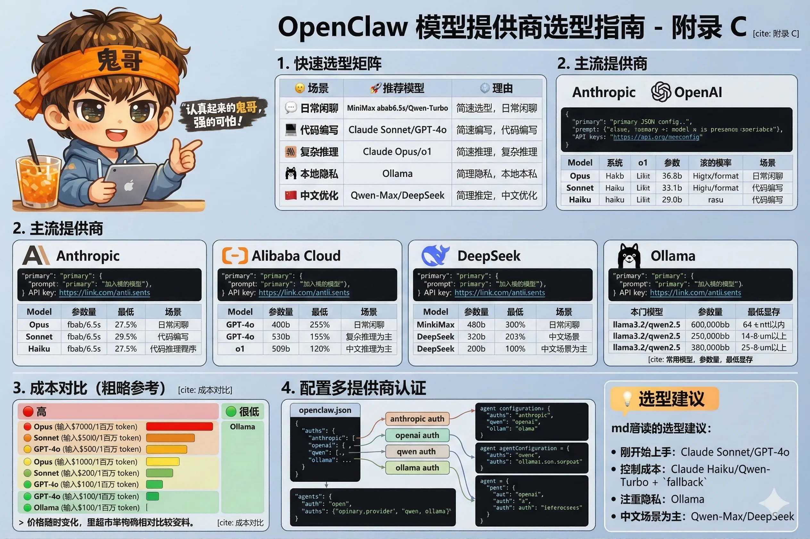

# 附录 C：模型提供商选型指南



OpenClaw 支持通过统一的 `provider/model-id` 格式对接多家模型提供商。本附录帮你在成本、能力、速度之间找到适合自己场景的组合。

---

## 快速选型矩阵

| 场景 | 推荐模型 | 理由 |
|---|---|---|
| 日常闲聊、简单问答 | MiniMax abab6.5s / Qwen-Turbo | 成本极低，响应快 |
| 代码编写、技术分析 | Claude Sonnet / GPT-4o | 代码能力强，性价比高 |
| 复杂推理、长文档分析 | Claude Opus / o1 | 最强推理，按需使用 |
| 本地隐私场景 | Ollama（本地） | 完全离线，数据不出本地 |
| 中文优化场景 | Qwen-Max / DeepSeek | 中文理解和生成更自然 |

---

## 主流提供商

### Anthropic（Claude 系列）

```json
"model": {
  "primary": "anthropic/claude-sonnet-4-6"
}
```

| 模型 ID | 特点 | 适合场景 |
|---|---|---|
| `anthropic/claude-opus-4-6` | 最强推理，最高成本 | 复杂分析、长文档、高精度任务 |
| `anthropic/claude-sonnet-4-6` | 能力与成本均衡 | **日常首选**，代码、分析、写作 |
| `anthropic/claude-haiku-4-5-20251001` | 速度快，成本低 | 简单任务、高频调用 |

**优势**：指令遵循能力强，代码质量高，长上下文支持好。

**获取 API Key**：[console.anthropic.com](https://console.anthropic.com)

---

### OpenAI（GPT 系列）

```json
"model": {
  "primary": "openai/gpt-4o"
}
```

| 模型 ID | 特点 | 适合场景 |
|---|---|---|
| `openai/gpt-4o` | 多模态，能力全面 | 需要视觉理解的任务 |
| `openai/gpt-4o-mini` | 轻量快速 | 日常问答，成本敏感 |
| `openai/o1` | 深度推理 | 数学、逻辑、复杂问题 |

**获取 API Key**：[platform.openai.com](https://platform.openai.com)

---

### 阿里云（Qwen 系列）

```json
"model": {
  "primary": "qwen/qwen-max"
}
```

| 模型 ID | 特点 |
|---|---|
| `qwen/qwen-max` | 中文能力强，综合性能好 |
| `qwen/qwen-turbo` | 速度快，成本低 |
| `qwen/qwen-long` | 超长上下文（最高 100 万 token） |

**优势**：中文理解和生成质量高，国内访问无网络问题，有免费额度。

**获取 API Key**：[dashscope.aliyuncs.com](https://dashscope.aliyuncs.com)

---

### MiniMax

```json
"model": {
  "primary": "minimax/abab6.5s-chat"
}
```

| 模型 ID | 特点 |
|---|---|
| `minimax/abab6.5s-chat` | 成本极低，中文流畅 |
| `minimax/abab6.5-chat` | 能力更强，成本略高 |

**优势**：日常闲聊场景性价比最高，中文对话体验好。

---

### DeepSeek

```json
"model": {
  "primary": "deepseek/deepseek-chat"
}
```

| 模型 ID | 特点 |
|---|---|
| `deepseek/deepseek-chat` | 综合能力强，价格低廉 |
| `deepseek/deepseek-reasoner` | 深度推理（类 o1） |

**优势**：代码能力出色，价格在同等能力模型中极具竞争力。

---

### Ollama（本地模型）

```json
"model": {
  "primary": "ollama/llama3.2"
}
```

| 常用模型 | 参数量 | 最低显存 |
|---|---|---|
| `ollama/llama3.2` | 3B | 4GB |
| `ollama/llama3.1` | 8B | 8GB |
| `ollama/qwen2.5` | 7B | 8GB |
| `ollama/mistral` | 7B | 8GB |
| `ollama/deepseek-r1` | 7B | 8GB |

**优势**：完全本地运行，数据不出设备，无 API 费用，适合隐私敏感场景。

**前提**：需要先安装 Ollama 并下载对应模型：
```bash
ollama pull llama3.2
```

---

## 成本对比（粗略参考）

> 价格随时变化，以官网为准。以下为相对量级参考。

| 模型 | 输入（每百万 token） | 输出（每百万 token） | 相对成本 |
|---|---|---|---|
| Claude Opus 4 | ~$15 | ~$75 | 🔴 高 |
| Claude Sonnet 4 | ~$3 | ~$15 | 🟡 中 |
| GPT-4o | ~$2.5 | ~$10 | 🟡 中 |
| Claude Haiku | ~$0.25 | ~$1.25 | 🟢 低 |
| GPT-4o-mini | ~$0.15 | ~$0.6 | 🟢 低 |
| DeepSeek Chat | ~$0.14 | ~$0.28 | 🟢 低 |
| Qwen-Turbo | ~$0.05 | ~$0.15 | 🟢 很低 |
| MiniMax abab6.5s | ~$0.01 | ~$0.02 | 🟢 极低 |
| Ollama（本地） | $0 | $0 | 免费 |

---

## 配置多提供商认证

如果你同时用多家提供商，在 `openclaw.json` 里分别配置：

```json
{
  "auths": {
    "anthropic": {
      "apiKey": "sk-ant-..."
    },
    "openai": {
      "apiKey": "sk-..."
    },
    "qwen": {
      "apiKey": "sk-..."
    },
    "ollama": {
      "baseUrl": "http://localhost:11434"
    }
  }
}
```

然后在 Agent 里引用：

```json
{
  "agents": {
    "list": [
      {
        "id": "casual",
        "model": { "primary": "minimax/abab6.5s-chat" },
        "auth": "minimax"
      },
      {
        "id": "analyst",
        "model": { "primary": "anthropic/claude-opus-4-6" },
        "auth": "anthropic"
      }
    ]
  }
}
```

---

## 选型建议

**刚开始上手**：用 Claude Sonnet 或 GPT-4o，能力全面，踩坑少。

**控制成本**：主模型用 Claude Haiku 或 Qwen-Turbo 处理日常，重要任务用 `model.fallback` 升级。

**注重隐私**：Ollama 本地运行，数据不离开你的机器。

**中文场景为主**：Qwen-Max 或 DeepSeek，中文质量更稳定，且无网络问题。
