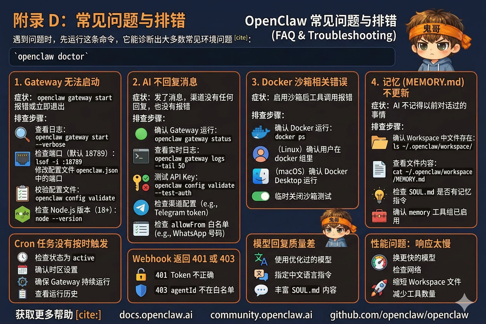

# 附录 D：常见问题与排错



遇到问题时，先运行这条命令，它能诊断出大多数常见环境问题：

```bash
openclaw doctor
```

---

## Gateway 无法启动

**症状**：`openclaw gateway start` 报错或立即退出。

**排查步骤**：

1. 查看详细错误日志：
   ```bash
   openclaw gateway start --verbose
   ```

2. 检查端口是否被占用（默认 18789）：
   ```bash
   lsof -i :18789
   ```
   如果有其他进程占用，要么结束那个进程，要么在 `openclaw.json` 里修改端口：
   ```json
   { "gateway": { "port": 18790 } }
   ```

3. 检查配置文件语法：
   ```bash
   openclaw config validate
   ```
   JSON 格式错误（多了逗号、少了引号）是最常见的启动失败原因。

4. 检查 Node.js 版本（需要 18+）：
   ```bash
   node --version
   ```

---

## AI 不回复消息

**症状**：发了消息，渠道里没有任何回复，也没有报错。

**排查步骤**：

1. 确认 Gateway 正在运行：
   ```bash
   openclaw gateway status
   ```

2. 查看实时日志，发消息，观察是否有请求进来：
   ```bash
   openclaw gateway logs --tail 50
   ```

3. 检查 API Key 是否有效——最常见的原因是 Key 过期或余额不足：
   ```bash
   openclaw config validate --test-auth
   ```

4. 检查渠道配置，以 Telegram 为例，确认 bot token 正确且 bot 没有被 Block：
   ```bash
   openclaw gateway logs | grep -i telegram
   ```

5. 检查 `allowFrom` 配置——WhatsApp 等渠道有白名单，你的号码是否在列表里：
   ```json
   "whatsapp": { "allowFrom": ["+8613800138000"] }
   ```

---

## Cron 任务没有按时触发

**症状**：到了设定时间，任务没有运行。

**排查步骤**：

1. 检查任务状态是否为 `active`：
   ```bash
   openclaw cron list
   ```
   如果是 `paused`，运行 `openclaw cron resume --id <jobId>`。

2. 确认时区设置正确：
   ```bash
   openclaw cron list --verbose
   ```
   `0 8 * * *` 配合 `--timezone Asia/Shanghai` 才是北京时间 8 点，不加时区默认 UTC（差 8 小时）。

3. 检查 Gateway 在任务应该触发时是否在运行——Cron 依赖 Gateway 持续运行。如果 Gateway 重启了，在重启之前应该触发的任务会跳过（不补跑）。

4. 查看任务的运行历史，看是否有错误信息：
   ```bash
   openclaw cron runs --id <jobId> --limit 5
   ```

---

## Webhook 返回 401 或 403

**症状**：`curl` 调用 Webhook 返回 `401 Unauthorized` 或 `403 Forbidden`。

**原因和修复**：

- `401`：Token 不正确或格式错误。确认请求头是 `Authorization: Bearer your-token`，不是 `Authorization: your-token`。
- `403`：Token 正确，但请求的 `agentId` 不在 `allowedAgentIds` 白名单里。检查 `hooks.allowedAgentIds` 配置。
- `429`：连续认证失败触发了速率限制，等几分钟再试。

---

## Docker 沙箱相关错误

**症状**：启用沙箱后，exec 工具调用报错 `docker: command not found` 或 `permission denied`。

**排查步骤**：

1. 确认 Docker 已安装且在运行：
   ```bash
   docker ps
   ```

2. 确认当前用户在 docker 组里（Linux）：
   ```bash
   groups $USER
   # 如果没有 docker，执行：
   sudo usermod -aG docker $USER
   # 然后重新登录
   ```

3. macOS 上确认 Docker Desktop 正在运行（菜单栏有图标）。

4. 临时关闭沙箱确认问题是否出在 Docker：
   ```json
   "sandbox": { "mode": "off" }
   ```
   如果关掉沙箱后正常，问题就在 Docker 配置。

---

## 记忆（MEMORY.md）不更新

**症状**：和 AI 说过的事情，下次对话它完全不记得。

**排查步骤**：

1. 确认 `MEMORY.md` 文件存在于 Workspace 目录：
   ```bash
   ls ~/.openclaw/workspace/
   ```

2. 查看 `MEMORY.md` 是否有内容，如果是空文件，AI 可能认为不需要记录：
   ```bash
   cat ~/.openclaw/workspace/MEMORY.md
   ```

3. 检查 `SOUL.md` 里是否有记忆相关的指令。如果没有，AI 可能不知道应该主动记录。可以在 `SOUL.md` 末尾加上：
   ```markdown
   ## 记忆规则
   当用户分享个人信息、偏好、重要事项时，及时更新 MEMORY.md。
   每次对话开始前，先读取 MEMORY.md 了解用户信息。
   ```

4. 确认 `memory` 工具组已启用（`minimal` 和 `coding` 画像默认包含）。

---

## 模型回复中文但质量差

**症状**：AI 能回复中文，但用词生硬，或者回复内容不符合预期。

**可能原因和改进**：

1. **使用了对中文优化不足的模型**：切换到 Qwen 或 DeepSeek 系列，中文效果更好。

2. **SOUL.md 里没有指定语言**：明确加上 `使用中文回复` 或 `始终用简体中文交流`。

3. **SOUL.md 太短**：给 AI 更多上下文，比如你的职业、使用场景、偏好的回复风格。

---

## 性能问题：响应太慢

**症状**：每条消息要等 10 秒以上才有回复。

**排查和优化**：

1. **换更快的模型**：Claude Haiku、GPT-4o-mini、Qwen-Turbo 的响应速度显著快于大模型。

2. **检查网络**：模型 API 在海外，网络延迟会直接影响响应速度。使用代理或选择有国内节点的提供商（如 Qwen）。

3. **缩短 Workspace 文件**：`SOUL.md`、`MEMORY.md` 过长会增加每次请求的 token 数，影响速度和成本。定期清理不再需要的内容。

4. **减少工具数量**：工具越多，AI 思考"要不要调用工具"的时间越长。只启用真正需要的工具组。

---

## 获取更多帮助

- **官方文档**：[docs.openclaw.ai](https://docs.openclaw.ai)
- **社区论坛**：[community.openclaw.ai](https://community.openclaw.ai)
- **GitHub Issues**：[github.com/openclaw/openclaw](https://github.com/openclaw/openclaw)

提交 issue 时，附上 `openclaw doctor` 的输出和相关日志，能帮助更快定位问题。
