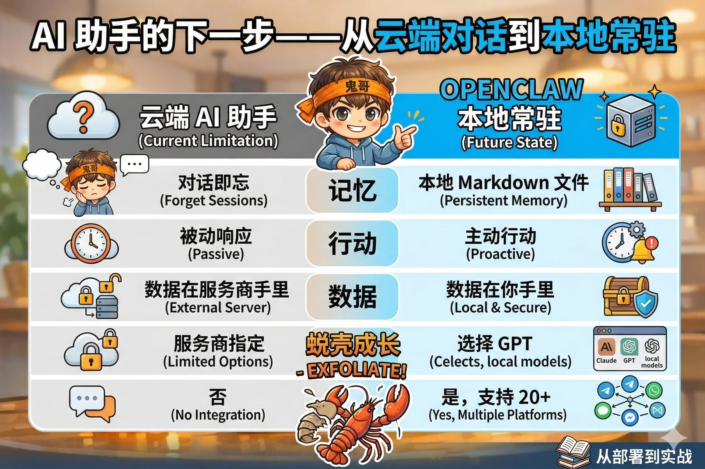

# 第1章：AI 助手的下一步——从云端对话到本地常驻

## 你一定遇到过这种情况

花了一个下午，把自己的工作习惯、口味偏好、常用工具都跟 ChatGPT 说了一遍。它表现得很好，记住了你不喜欢代码里加多余注释，知道你是个 Python 程序员，也清楚你的邮件风格是简短直接。

然后你换了个浏览器。

对话框清空了。它不认识你了。你面对的是一个陌生人。

你叹了口气，重新开始介绍自己。

这不是你的错，也不是 AI 的错。这是当前这代"云端对话式 AI 助手"的结构性局限——它们生来如此。理解这些局限，是理解 OpenClaw 为什么存在的起点。

---

## 云端 AI 助手的三道墙

### 第一道墙：对话即忘

现在主流的 AI 助手，无论是 ChatGPT、Claude 还是 Gemini，它们的记忆单位是**会话**（Session）。会话结束，记忆清空。下一次对话，你是一个全新的陌生人。

有些产品推出了"记忆功能"，可以保存一些偏好。但这些记忆保存在**服务商的服务器**上，你不知道它保存了什么，也不知道它在何时调用，更无法精确控制——它像一个健忘的秘书，你永远不确定今天的它还记得多少昨天的事。

真正的持久记忆，应该像你的笔记本一样：你写什么，它记什么，你想查，随时能查。

### 第二道墙：只能等你开口

现在的 AI 助手，本质上是一个**被动响应者**。

你不问，它不答。它不会在今天下午两点提醒你明天有个重要会议，不会在早上八点主动告诉你上海今天会下雨建议带伞，更不会在你的邮件堆积了三天之后，主动发条消息说"嘿，你有七封没回"。

如果你希望 AI 助手真正帮你管理生活，光靠"问答模式"是不够的。你需要一个能**主动行动**的助手，就像真正的秘书——你不在的时候，它也在工作。

### 第三道墙：数据不在你手里

每次你跟云端 AI 对话，这些内容都上传到了别人的服务器。你聊了什么工作项目、提了什么客户名字、分享了什么私人困扰——都在那里。

大多数人对此习以为常，就像习惯了把照片放在 iCloud 一样。但当你开始把 AI 当成真正的私人助手，当你的对话内容越来越接近"核心隐私"，这个问题就值得认真对待了。

更实际的问题是：如果服务商今天修改政策，明天涨价，后天宕机，你的助手就消失了。你积累的一切，都建立在别人的地基上。

---

## OpenClaw：把 AI 助手装进自己的口袋

OpenClaw 的答案很直接：**把整个 AI 助手系统搬回你自己的机器上运行**。

它不是一个 App，不是一个网页，而是一个跑在你电脑（或服务器）上的**本地服务**。你的数据在本地，你的记忆在本地，你的配置在本地——全部是普通的文本文件，用 git 可以追踪，用任何编辑器可以修改。

一句话概括 OpenClaw 的核心理念：

> **Your assistant. Your machine. Your rules.**
> 你的助手。你的机器。你说了算。

为了让这个对比更直观，我们来看一张表：

| | 云端 AI 助手 | OpenClaw |
|---|---|---|
| 记忆存在哪里 | 服务商服务器 | 你的本地 Markdown 文件 |
| 能主动行动吗 | 否，只能等你问 | 是，支持定时任务和事件触发 |
| 数据在谁手里 | 服务商 | 你自己 |
| 用什么模型 | 服务商指定 | 随你换，Claude/GPT/本地模型都行 |
| 能接入微信/WhatsApp 吗 | 否 | 是，支持 20+ 聊天平台 |
| 服务商倒闭了怎么办 | 助手消失 | 换个模型接口继续跑 |

当然，OpenClaw 也有代价：它需要你自己安装和维护，需要你有一台能常驻运行的机器，学习曲线比打开网页聊天要陡一些。

但如果你希望一个真正属于自己的 AI 助手——它了解你、记得你、能主动帮你工作，而且数据不离开你的掌控——这些代价是值得的。

这本书，就是帮你把这个代价降到最低。

---

## 一只龙虾的故事

在聊怎么用 OpenClaw 之前，先讲个小故事。因为了解它从哪里来，会让你更理解它是什么。

OpenClaw 的前身叫 **Warelay**——一个 WhatsApp 消息网关项目。它的创作者 Peter 有一天突发奇想：如果把 Claude 接到 WhatsApp 上，让它驻留在消息里，会发生什么？

结果发现，效果出乎意料地好。于是项目开始认真起来，Claude 的实例被命名为 **Clawd**，日期是 2025 年 11 月 25 日。

好景不长。Anthropic（Claude 的开发商）的法务部门注意到了"Clawd"这个名字——毕竟和他们的产品"Claude"太像了。Peter 不得不给项目换名，于是 Clawd 经历了一次"蜕壳"，短暂变成了 **Molty**（取自 molt，蜕壳之意）。

2026 年 1 月 30 日，项目完成了最终蜕变，正式更名为 **OpenClaw**。

在宣布更名后的几分钟内，加密货币骗子就抢注了 @openclaw 的 Twitter 账号，开始发布假冒的"OpenClaw 代币"信息。（AI 项目的命名仪式，果然少不了这个环节。）社区成员们紧急出动，用三个小时完成了 GitHub、npm、文档站等所有平台的品牌迁移。

这个故事里有一个贯穿 OpenClaw 文化的象征：**龙虾蜕壳是为了成长**。旧的壳是保护，也是束缚。蜕掉它，才能继续长大。

顺带一提，OpenClaw 的社区有一句非常有精气神的口号，是对科幻经典"EXTERMINATE（消灭）"的改写——

> **EXFOLIATE!**（焕新！）

这大概是目前为止，技术社区里最温柔的战斗口号了。

---

## 本书要带你去哪里

读完这本书，你将能够：

- 在自己的机器上部署一个完整的 OpenClaw 实例
- 把它接入 Telegram、WhatsApp 等你日常使用的聊天工具
- 定制它的性格、记忆和工具能力
- 配置定时任务，让它主动为你工作
- 搭建多个 AI 智能体协同工作的系统
- 完成几个真实可用的实战项目：个人助理、浏览器自动化、智能家居控制

我们的节奏是：**先建立心智模型，再动手，再深入**。每章的概念量都经过控制，不会把你淹没在配置项里。每章结尾都有动手练习，5 分钟内可以完成，帮你即时验证学到的东西。

好，准备好了吗？下一章，我们来看 OpenClaw 的全貌。

---

::: tip 本章检查清单
- [ ] 你能说出当前云端 AI 助手的三个核心局限是什么吗？
- [ ] 你理解"本地优先"的含义了吗——OpenClaw 的数据和配置存放在哪里？
- [ ] "Your assistant. Your machine. Your rules." 这句话让你联想到了什么？
:::
