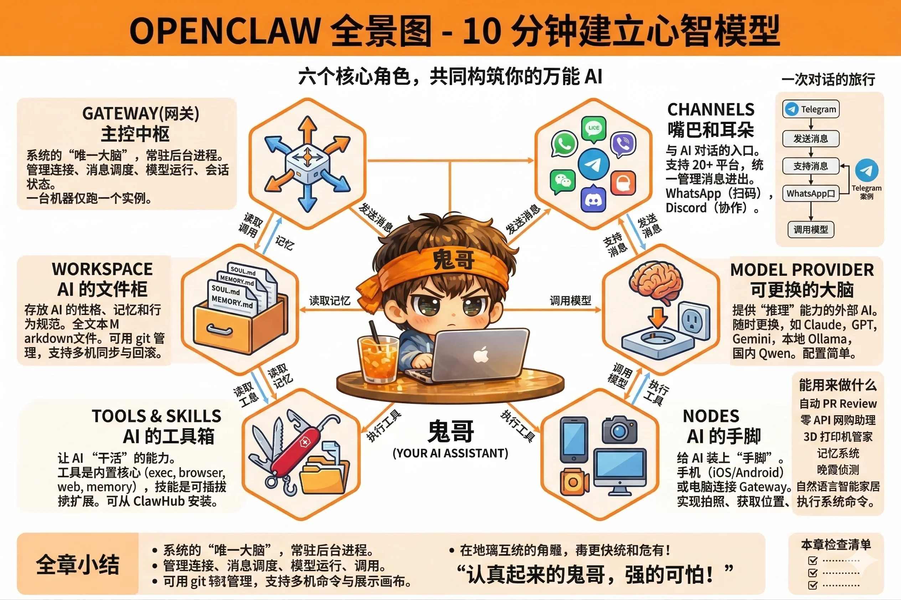
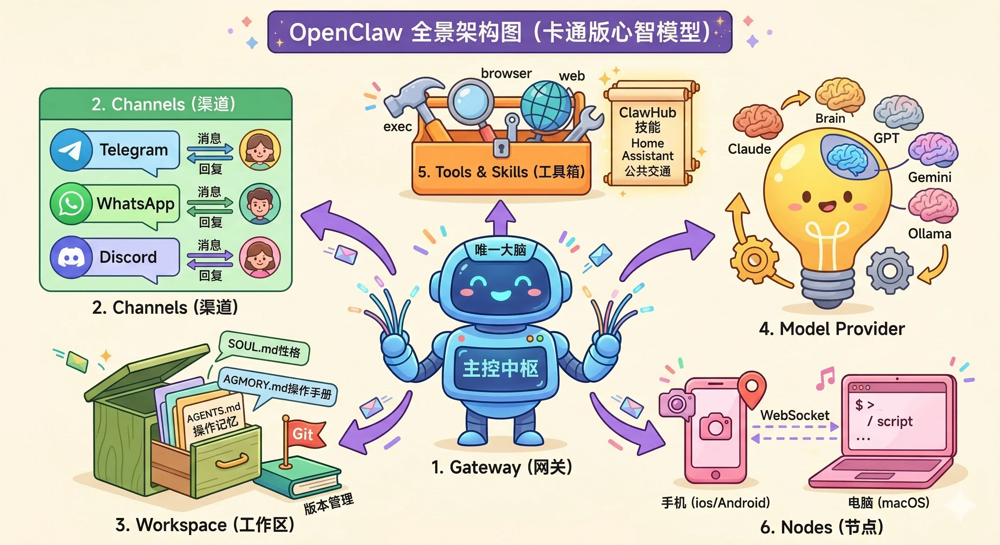

# 第2章：OpenClaw 全景图——10 分钟建立心智模型

上一章我们聊了 OpenClaw 是什么、为什么存在。这一章我们来看它**长什么样**。

在动手安装之前，先在脑子里画一张草图——这是最值得花时间的事。草图画对了，后面遇到任何配置问题，你都能大致知道去哪里找答案；草图没画，就算跟着步骤装好了，也很容易在第一个报错面前彻底迷路。

OpenClaw 的整体架构由六个角色组成，我们一一认识。

---

## 认识六个角色

### 角色一：Gateway（网关）——主控中枢

Gateway 是整个 OpenClaw 系统的**唯一大脑**，一个跑在你机器上的常驻后台进程。

类比：它就像你家的智能家居中枢——所有的智能灯、门锁、空调都连到这个中枢上，由它统一管理。没有这个中枢，每个设备都是孤岛；有了它，你说一句"回家模式"，灯亮了、空调开了、门锁解了。

Gateway 做的事情类似：管理所有渠道的连接、接收和分发消息、调度 AI 模型运行、存储会话状态。**同一时刻，一台机器上只能跑一个 Gateway 实例**（就像你家只需要一个中枢），这是它的设计原则。

你平时不需要直接跟 Gateway 打交道——它安静地跑在后台，你跟它的沟通渠道是 CLI 命令行、Web Dashboard，以及下面要介绍的各种渠道。

### 角色二：Channels（渠道）——嘴巴和耳朵

渠道是你和 AI 说话的入口。

类比：Gateway 上有很多插座，每个聊天平台是一个插头。WhatsApp 是一个插头，Telegram 是另一个，Discord 又是一个。你可以同时插上多个，Gateway 统一管理所有的进出消息。

OpenClaw 支持超过 20 个聊天平台，包括 WhatsApp、Telegram、Discord、Slack、Signal、iMessage、飞书、Line、Matrix……基本上你日常用的聊天工具，大概率都在列表里。

不同渠道有不同特点：Telegram 是最容易上手的（申请个 Bot Token 就能用），WhatsApp 需要 QR 码扫码配对，Discord 适合在服务器里和多人协作。但对你来说，它们的使用体验是一样的——打开聊天窗口，发消息，等回复。

### 角色三：Workspace（工作区）——AI 的文件柜

Workspace 是 OpenClaw 里最有意思的设计之一：**AI 的性格、记忆和行为规范，全部存成普通的 Markdown 文本文件**，放在你本地的一个目录里（默认是 `~/.openclaw/workspace`）。

类比：这是 AI 的文件柜。柜子里放着几个核心文件——

- **SOUL.md**：它的性格档案。你可以在这里写"说话要简洁，不要废话"，或者"你是一个擅长调侃的技术极客"，AI 就会按这个风格行事。
- **AGENTS.md**：操作手册。告诉 AI 遇到各种情况该怎么处理。
- **MEMORY.md**：长期记忆。那些需要永久记住的事，都写在这里——比如"主人是个 Python 程序员，不吃香菜"。
- **USER.md**：关于你的信息，帮 AI 更了解你。

这些文件是普通文本，你可以直接用编辑器打开修改，也可以在对话里让 AI 自己去写。当你跟 AI 说"记住这件事"，它会把内容追加到相应的 Markdown 文件里——不是存到什么神秘的数据库，就是你能打开、能读、能编辑的文本文件。

这个设计还有一个意外的好处：**Workspace 可以用 git 管理**。你对 AI 的所有"调教"都有版本历史，改坏了可以回滚，甚至可以在多台机器间同步。

### 角色四：Model Provider（模型提供商）——可更换的大脑

Gateway 本身不是 AI，它只是一个调度框架。真正做"推理"这件事的，是外部的大语言模型——也就是 Model Provider。

类比：Gateway 是一副躯体，Model Provider 是装进去的大脑。而且这颗大脑**可以随时更换**——你可以用 Anthropic 的 Claude，可以用 OpenAI 的 GPT，可以用 Google 的 Gemini，也可以用跑在本地的 Ollama 模型，甚至可以接国内的 Qwen、GLM、MiniMax。

切换模型不需要改任何业务逻辑，只需要改一行配置。这意味着：如果某个提供商涨价了，换一个；如果有新模型发布，试一试；如果你的任务不需要最强模型，用个便宜的省钱。框架不变，大脑随时可换。

### 角色五：Tools & Skills（工具与技能）——AI 的工具箱

一个只能聊天的 AI 助手，就像一个只会说话、不会动手的员工。OpenClaw 通过工具（Tools）和技能（Skills）让 AI 真正能**干活**。

**工具**是内置的核心能力：
- `exec`：执行终端命令——让 AI 帮你跑脚本、查系统状态
- `browser`：控制浏览器——让 AI 自动填表、截图、抓数据
- `web`：搜索网络——让 AI 查最新资讯
- `memory`：读写记忆文件

**技能**是可插拔的扩展包：一个技能就是一个文件夹，里面有一个 `SKILL.md` 告诉 AI 怎么使用某个特定工具或服务。比如有人写了一个"Home Assistant 技能"，装上之后 AI 就会用自然语言控制你家的智能设备；有人写了一个"Vienna 公共交通技能"，AI 就能查维也纳的实时发车时间。

技能的公共注册中心叫 **ClawHub**，你可以在那里找到社区贡献的各种技能，一行命令安装。

### 角色六：Nodes（设备节点）——AI 的手脚

如果说前五个角色构成了 AI 的"大脑和嘴巴"，Nodes 就是给它装上了"手脚"。

你的手机（iOS/Android）或电脑（macOS）可以作为"节点"连接到 Gateway。连上之后，AI 就获得了一些有趣的能力：
- 用你手机的**摄像头**拍照（"帮我拍一下这道菜"）
- 查询你手机的**当前位置**
- 在你的电脑上**执行系统命令**
- 在屏幕上**展示画布**内容

节点通过 WebSocket 连接到 Gateway，配对一次，长期有效。你的手机不需要和电脑在同一个局域网，只要能访问到 Gateway 的地址就行。

---

## 一次对话的旅行

六个角色都认识了，现在看看它们怎么协作。

假设你在 Telegram 上给 AI 发了一条消息："帮我查一下明天上海的天气，顺便提醒我下午三点有个会议。"

**发生了什么：**

1. **Telegram 渠道**收到你的消息，转发给 Gateway
2. **Gateway** 查找这条消息对应的会话，判断应该由哪个 Agent 处理
3. **Gateway** 从 **Workspace** 里读取相关文件（你的性格设定、历史记忆、操作指南），和你的消息一起组装成一个完整的上下文
4. 这个上下文被发送给 **Model Provider**（比如 Claude），AI 开始思考
5. AI 决定调用两个**工具**：`web` 工具查天气，`cron` 工具设置一个下午三点的提醒
6. 工具执行完毕，AI 把结果组织成回复，经由 **Gateway** 发回 **Telegram 渠道**
7. 你收到消息："明天上海阴天，最高 18°C。提醒已设置，下午三点我会通知你。"

整个过程，你只是发了一条消息。

---

---

## 能用来做什么

六个角色、一次旅行——理论讲完了。来看看现实世界里人们用 OpenClaw 在做什么，让你感受一下想象力的上限在哪里。

**自动 PR Review**
一位开发者把 GitHub 和 Telegram 接通：每次有 PR 提交，AI 自动 review 代码，把合并建议和发现的问题推送到 Telegram。他再也不用盯着 GitHub 通知了。

**零 API 网购助理**
有人让 AI 每周定期打开 Tesco 网站（英国超市），根据家里的饮食计划自动把商品加入购物车，预约配送时间。全程用 browser 工具操作，不依赖任何官方 API。

**3D 打印机管家**
连上 Bambu Lab 打印机后，只需要发一条消息就能查打印进度、暂停任务、启动校准——打印机的状态实时推送到手机。

**1000 条语音备忘录的记忆系统**
一位用户把多年积累的 1000+ 条 WhatsApp 语音备忘录全部导入 OpenClaw，用语音转文字 + 向量索引处理后，现在可以语义搜索所有历史备忘——"我之前说过要买什么来着？"

**晚霞侦测摄影师**
把屋顶摄像头接入 Nodes，配置了一个心跳任务：每隔 30 分钟让 AI 看一眼摄像头画面，如果检测到好看的晚霞，自动拍照发到手机。

**自然语言控制智能家居**
通过 Home Assistant 技能，对话里直接说"帮我把客厅灯调成暖光，空气净化器开二档"——AI 自动调用接口执行，不需要打开任何 App。

---

## 全章小结

六个角色，一句话概括它们的分工：

- **Gateway** 是中枢，把所有角色组织在一起
- **Channels** 是入口，你从哪个聊天工具说话都行
- **Workspace** 是灵魂，AI 的性格和记忆都在这里
- **Model Provider** 是大脑，可以随时更换
- **Tools & Skills** 是双手，让 AI 真正能干活
- **Nodes** 是感知，给 AI 接入物理世界的眼睛和手脚

记住这张图，下一章我们开始动手：安装 OpenClaw，启动 Gateway，完成第一次对话。

---

::: tip 本章检查清单
- [ ] 你能不看书，说出 OpenClaw 六个核心角色的名字和一句话职责吗？
- [ ] Gateway 和 Model Provider 有什么区别？（提示：一个是框架，一个是大脑）
- [ ] Workspace 里的文件是什么格式？为什么说它"可以用 git 管理"？
:::
