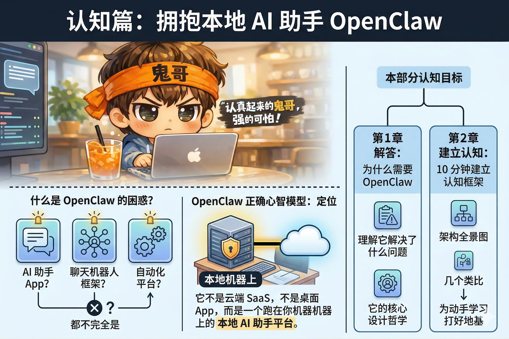

# 第一部分：认知篇

在动手安装之前，我们先花两章的时间建立心智模型。

很多人第一次接触 OpenClaw 时会感到困惑：它到底是一个聊天机器人框架？一个 AI 助手 App？还是一个自动化平台？答案是：都有一点，但又都不完全是。

这种困惑的根源在于，OpenClaw 的定位确实比较新颖——它不是云端 SaaS，不是桌面 App，而是一个**跑在你自己机器上的本地 AI 助手平台**。如果没有先建立正确的心智模型就直接上手，很容易在配置的细节里迷路。

**本部分包含两章：**

- **第1章** 解答"为什么需要 OpenClaw"，帮你理解它解决了什么问题，以及它的核心设计哲学。
- **第2章** 用一张架构全景图和几个类比，帮你在 10 分钟内建立起 OpenClaw 的整体认知框架，为后续的动手学习打好地基。
