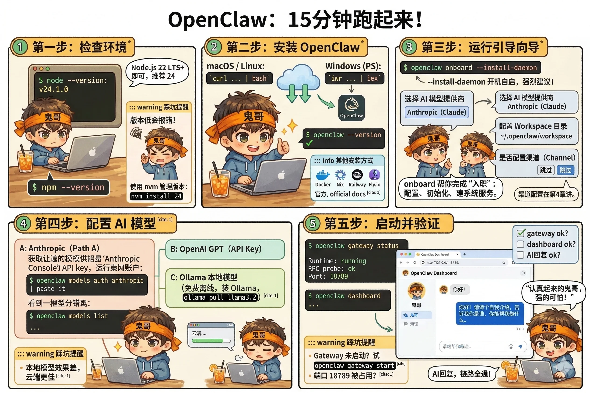

# 第3章：安装与启动——15 分钟跑起来

这一章结束的时候，你会拥有一个真正运行在本地的 OpenClaw 实例，能通过 Web 界面和 AI 完成第一次对话。

不需要 Docker，不需要数据库，不需要云服务账号（模型 API Key 除外）。就是一个跑在你电脑上的进程。

准备好了？开始。



---

## 第一步：检查环境

OpenClaw 基于 Node.js 运行。打开终端，先确认版本：

```bash
node --version
```

你需要看到 `v22.x.x` 或更高版本。官方推荐 Node 24，Node 22 LTS 也完全支持。

::: warning 踩坑提醒
如果版本低于 22，后续安装会报错，而且错误信息不一定直白。先升级再继续。

推荐用 [nvm](https://github.com/nvm-sh/nvm) 管理 Node 版本，一行命令切换，不影响系统其他项目：
```bash
nvm install 24
nvm use 24
```
:::

npm 一般随 Node 一起安装，也顺手检查一下：

```bash
npm --version
```

有输出就行，版本无特殊要求。

---

## 第二步：安装 OpenClaw

**macOS / Linux：**

```bash
curl -fsSL https://openclaw.ai/install.sh | bash
```

**Windows（PowerShell）：**

```powershell
iwr -useb https://openclaw.ai/install.ps1 | iex
```

脚本会自动下载最新版本，安装到系统路径。安装完成后，验证一下：

```bash
openclaw --version
```

能看到版本号，说明安装成功了。

::: info 其他安装方式
如果你习惯用 Docker、Nix 或者想部署到服务器，官方文档的 [Install](https://docs.openclaw.ai/install) 章节有对应的详细指引，包括 Docker、Kubernetes、Railway、Fly.io 等平台的部署方案。本书聚焦本地安装，服务器部署不展开讲。
:::

---

## 第三步：运行引导向导

这是整个安装过程最重要的一步。运行：

```bash
openclaw onboard --install-daemon
```

`--install-daemon` 的意思是：把 Gateway 注册为系统服务，开机自动启动。强烈建议加上这个参数——你不会希望每次重启电脑都要手动启动 Gateway 的。

向导会依次问你几个问题，我们逐一解释：

### 选择 AI 模型提供商

向导会让你选一个 AI 模型的来源。这里先选一个能用的，后续随时可以改。

- **Anthropic（Claude）**：效果最好，需要 API Key
- **OpenAI（GPT）**：同样优秀，需要 API Key
- **Ollama（本地模型）**：免费，完全离线，但需要先安装 Ollama 并下载模型

三条路的具体配置方法在下一步详细说明。

### 配置 Workspace 目录

Workspace 是 AI 的文件柜（第2章介绍过），向导会问你放在哪里。

直接回车接受默认值 `~/.openclaw/workspace` 即可。除非你有特殊需求，不建议改。

### 是否配置渠道（Channel）

向导会问要不要现在连接一个聊天渠道（WhatsApp、Telegram 等）。

**这里选"跳过"**。渠道配置有独立的步骤，第4章专门来讲。现在先把 Gateway 跑起来，渠道后面加。

::: tip 为什么这样设计？
向导之所以叫 `onboard`（而不是 `install`），是因为它做的不只是安装——它在帮你完成一次"入职"：配置认证、初始化 Workspace、建立系统服务。这个过程只需要走一次。
:::

---

## 第四步：配置 AI 模型

根据你在向导里的选择，按对应的路径操作。

### 路径 A：使用 Anthropic Claude

在 [Anthropic Console](https://console.anthropic.com) 注册账号，创建一个 API Key。然后配置：

```bash
openclaw models auth anthropic
```

按提示粘贴你的 API Key。完成后验证：

```bash
openclaw models list
```

能看到 Claude 系列模型，说明认证成功。

### 路径 B：使用 OpenAI GPT

在 [OpenAI Platform](https://platform.openai.com) 获取 API Key，然后：

```bash
openclaw models auth openai
```

同样粘贴 Key，`openclaw models list` 验证。

### 路径 C：使用 Ollama 本地模型（完全免费离线）

先安装 Ollama（如果还没装）：

```bash
# macOS
brew install ollama

# 或直接从官网下载：https://ollama.com
```

下载一个模型，推荐从 Llama3 开始：

```bash
ollama pull llama3.2
ollama serve  # 启动 Ollama 服务
```

OpenClaw 会自动检测本地运行的 Ollama，无需额外配置。

::: warning 踩坑提醒
Ollama 本地模型的效果和云端模型有明显差距，尤其在复杂推理和中文理解上。建议入门阶段先用云端模型，熟悉了 OpenClaw 的整体流程后再试本地模型。
:::

---

## 第五步：启动并验证

向导完成后，Gateway 应该已经作为系统服务在后台运行了。检查状态：

```bash
openclaw gateway status
```

你应该看到类似这样的输出：

```
Runtime:    running
RPC probe:  ok
Port:       18789
Uptime:     2m 34s
```

`Runtime: running` 和 `RPC probe: ok` 是关键，有这两行说明 Gateway 健康运行中。

接下来，打开 Web 控制台：

```bash
openclaw dashboard
```

这条命令会自动在浏览器里打开 `http://127.0.0.1:18789/`，你会看到 OpenClaw 的 Web 界面——聊天窗口、状态信息、配置入口都在这里。

::: warning 踩坑提醒
如果浏览器打开是空白页或者报"无法连接"，通常有两个原因：

1. **Gateway 没有正常启动**：运行 `openclaw gateway start` 手动启动，或检查 `openclaw logs` 看报错
2. **端口被占用**：默认端口是 18789，如果被其他程序占用，Gateway 会启动失败。可以在配置里改端口，或者先关掉占用 18789 的进程
:::

---

## 动手练习：第一次对话

Gateway 跑起来了，Dashboard 打开了，现在做一件事：

在 Web 聊天窗口里，发送这条消息：

```
你好！请做个自我介绍，告诉我你是谁，你能帮我做什么。
```

如果一切正常，你会收到 AI 的回复。它可能还没什么"个性"——那是因为我们还没有编辑 Workspace 里的文件。这是下一章的任务。

现在，你只需要确认：**它真的回复了**。这意味着完整的链路——Gateway → 模型提供商 → 回复——都通了。

::: tip 如果它没有回复
先别慌。运行 `openclaw logs --follow`，实时查看 Gateway 的日志，通常能直接看到哪里出了问题。最常见的原因是 API Key 配置有误，或者网络无法连接到模型服务商。
:::

---

::: tip 本章检查清单
- [ ] `openclaw gateway status` 输出的 `Runtime` 和 `RPC probe` 都是 ok 状态了吗？
- [ ] `openclaw dashboard` 能成功打开 Web 界面吗？
- [ ] AI 回复了你的自我介绍请求吗？
:::
