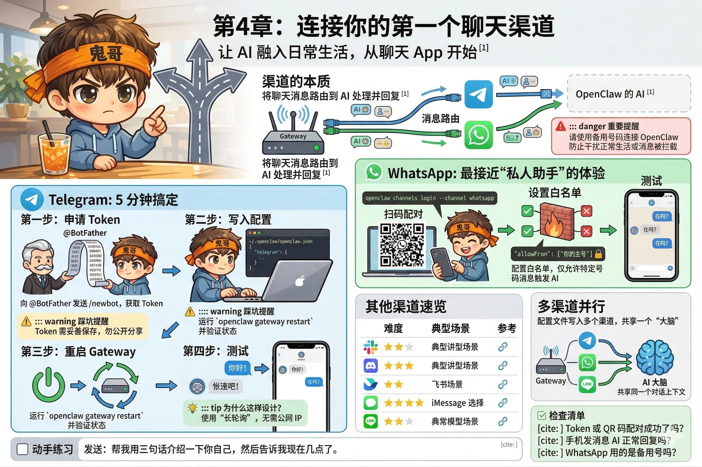

# 第4章：连接你的第一个聊天渠道

上一章，你通过浏览器的 Web 界面和 AI 完成了第一次对话。这很好，但说实话——有多少人愿意专门打开一个网页来找 AI 聊天？

真正让 AI 助手融入日常生活的方式，是让它住进你**已经在用的聊天工具**里。打开 Telegram，发条消息，AI 秒回；拿起手机，在 WhatsApp 里问它今天的日程，就像发消息给朋友一样自然。

这一章，我们来完成这个连接。



---

## 渠道的本质

回顾一下第2章的类比：渠道是 Gateway 上的插口，WhatsApp 是一个插头，Telegram 是另一个。

更具体地说：渠道连接建立之后，你在那个 App 里发给 Bot 的每一条消息，都会被路由到 OpenClaw 的 AI 处理，然后 AI 的回复会通过同一个渠道发回来。从你的角度看，就是在和一个聊天联系人对话。

OpenClaw 目前支持超过 20 个渠道，我们从最容易上手的 Telegram 开始。

---

## Telegram：5 分钟搞定

Telegram 是所有渠道里上手最快的，原因很简单：申请一个 Bot Token，填进配置文件，重启，完事。不需要扫码，不需要绑定手机号，不需要任何审批。

### 第一步：找 BotFather 申请 Token

打开 Telegram，搜索 **@BotFather**（官方认证的机器人管理员，名字旁边有蓝色对号），发送：

```
/newbot
```

BotFather 会依次问你两个问题：

1. **机器人的显示名称**（展示给用户看的名字）：随便起，比如 `My AI Assistant`
2. **机器人的用户名**（必须以 `bot` 结尾）：比如 `myai_helper_bot`

创建成功后，BotFather 会给你一串 Token，格式类似：

```
1234567890:ABCdefGHIjklMNOpqrSTUvwxYZ
```

**复制这个 Token，妥善保存**，这是你机器人的唯一凭证。

::: warning 踩坑提醒
Token 不要分享给任何人，也不要提交到 git 仓库。任何人拿到这个 Token，都可以控制你的机器人。后面的章节会介绍用环境变量而不是明文写入配置文件的最佳实践。
:::

### 第二步：写入配置文件

打开 `~/.openclaw/openclaw.json`，在 `channels` 字段里添加 Telegram 配置：

```json
{
  "channels": {
    "telegram": {
      "token": "1234567890:ABCdefGHIjklMNOpqrSTUvwxYZ"
    }
  }
}
```

如果文件里已经有其他内容，只需要把 `telegram` 部分加进 `channels` 对象里，不要覆盖其他配置。

### 第三步：重启 Gateway

配置文件修改后需要重启 Gateway 才会生效：

```bash
openclaw gateway restart
```

稍等几秒，验证状态：

```bash
openclaw gateway status
```

确认 `Runtime: running` 后，进行下一步。

### 第四步：测试

在 Telegram 里找到你刚创建的 Bot（搜索你设置的用户名），发送一条消息：

```
你好！
```

如果 AI 回复了，恭喜——Telegram 渠道配通了。

::: tip 为什么这样设计？
Telegram Bot 的接入方式是"长轮询"（Long Polling）：Bot 持续向 Telegram 服务器查询新消息。这意味着你的 Gateway 不需要公网 IP 或开放端口，在家里的局域网里就能正常工作。WhatsApp 的接入方式也是类似的。
:::

---

## WhatsApp：最接近"私人助手"的体验

WhatsApp 在全球有超过 20 亿用户，把 AI 接在这里，体验是最接近"真正的私人助手"的——因为你本来就在用 WhatsApp 和真人联系。

但在开始之前，有一个重要的事情要说清楚。

::: danger 重要提醒：请使用备用号
OpenClaw 的 WhatsApp 接入方式是 **WhatsApp Web 协议**——和你在电脑浏览器上扫码登录 WhatsApp Web 是同一个原理，只不过登录的是你的 AI 助手。

这意味着：**连接后，所有发到这个号码的消息都会被 AI 处理**，包括你和朋友、家人的私聊。

强烈建议使用一个**专门的备用手机号**（或者虚拟号码）来连接 OpenClaw，而不是你的个人主号。把这个号码当成 AI 助手的"工作号"，需要它帮忙时就发消息过去。

这不只是隐私问题——用主号接入还可能打乱你正常的 WhatsApp 使用（比如消息被 AI 拦截处理，你反而收不到原始通知）。
:::

### 扫码配对

确认使用备用号之后，在终端运行：

```bash
openclaw channels login --channel whatsapp
```

终端里会出现一个 **QR 码**（就是 WhatsApp Web 扫码登录的那个流程）。

拿出你的备用手机，打开 WhatsApp → 设置 → 已连接设备 → 连接设备，扫描终端里的 QR 码。

扫码成功后，终端会显示连接成功的提示，Gateway 会自动保存登录状态到本地——下次重启不需要重新扫码，就像浏览器保存了 WhatsApp Web 的登录状态一样。

### 配置允许发消息的号码

WhatsApp 渠道默认会接受**所有**发来的消息，包括陌生人。为了安全，建议在配置文件里设置白名单：

```json
{
  "channels": {
    "whatsapp": {
      "allowFrom": ["+8613800138000"]
    }
  }
}
```

把你自己的主号填进去，这样只有你发的消息会触发 AI，其他人发来的消息会被忽略（或者收到一个配对码提示，第10章的安全章节会详细讲这个机制）。

### 测试

重启 Gateway 后，用你的主号给备用号发条消息：

```
在吗？
```

AI 应该会回复。

---

## 其他渠道速览

OpenClaw 支持的渠道远不止 Telegram 和 WhatsApp。下表列出了常用渠道的基本情况：

| 渠道 | 上手难度 | 适用场景 | 参考文档 |
|---|---|---|---|
| Discord | ★★☆ 中 | 服务器协作、开发者社群 | [官方文档](https://docs.openclaw.ai/channels/discord) |
| Slack | ★★☆ 中 | 工作团队、企业内部 | [官方文档](https://docs.openclaw.ai/channels/slack) |
| 飞书 | ★★☆ 中 | 国内企业用户 | [官方文档](https://docs.openclaw.ai/channels/feishu) |
| iMessage | ★★★ 较难 | macOS 用户，需配合 BlueBubbles | [官方文档](https://docs.openclaw.ai/channels/imessage) |
| Signal | ★★★ 较难 | 注重隐私，需安装 signal-cli | [官方文档](https://docs.openclaw.ai/channels/signal) |
| Matrix | ★★★ 较难 | 开源去中心化 IM | [官方文档](https://docs.openclaw.ai/channels/matrix) |
| Line | ★★☆ 中 | 东南亚、日本用户 | [官方文档](https://docs.openclaw.ai/channels/line) |

各渠道的配置方式大同小异：申请对应平台的 Bot 账号或 Token，填入 `openclaw.json` 的 `channels` 字段，重启 Gateway。官方文档里每个渠道都有详细的步骤说明。

---

## 多渠道并行

OpenClaw 支持同时连接多个渠道——Telegram、WhatsApp、Discord 可以同时开着，消息默认都路由到同一个 AI 实例。

配置文件里把多个渠道并排写就行：

```json
{
  "channels": {
    "telegram": {
      "token": "你的TelegramToken"
    },
    "whatsapp": {
      "allowFrom": ["+8613800138000"]
    }
  }
}
```

这意味着你可以用手机上的 Telegram 和 AI 聊，也可以用 WhatsApp，AI 都会响应——但它们共享同一个对话上下文（同一个"大脑"）。

如果你希望不同渠道对应不同的 AI 人格、不同的模型，那是第13章"多智能体"要解决的问题，我们到时候再说。

---

## 动手练习

连上 Telegram 或 WhatsApp 之后，做一个小测试：

发送这条消息给你的 AI：

```
帮我用三句话介绍一下你自己，然后告诉我现在几点了。
```

如果 AI 不仅回了自我介绍，还正确报出了当前时间——说明 AI 不只是在"聊天"，它已经能感知外部信息了。

::: tip 本章检查清单
- [ ] 你的 Telegram Bot Token 或 WhatsApp QR 码配对成功了吗？
- [ ] 从手机发消息，AI 能正常回复吗？
- [ ] 如果接了 WhatsApp，你用的是备用号而不是个人主号吗？
:::
