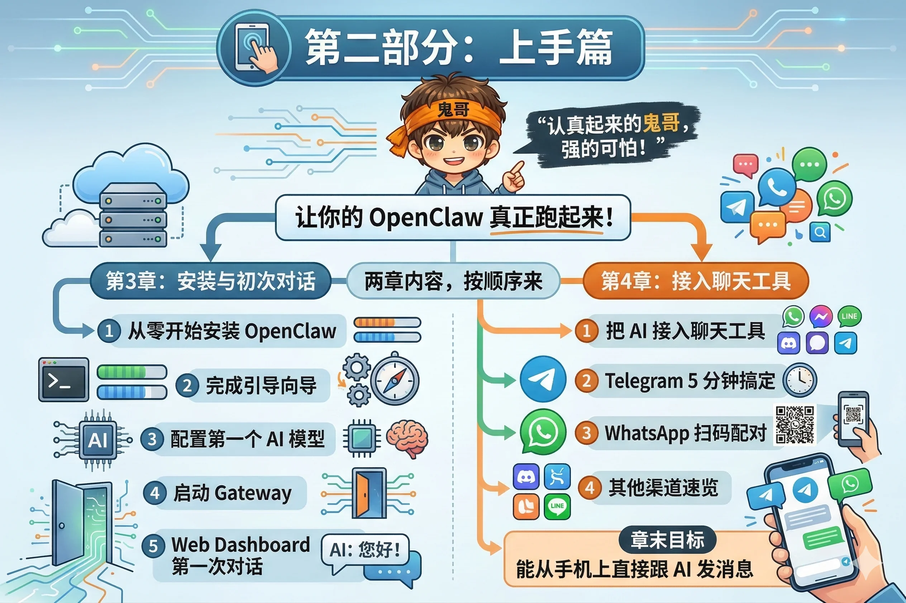

# 第二部分：上手篇

心智模型建立好了，现在动手。

这一部分只有一个目标：让你的 OpenClaw **真正跑起来**，并且能从你日常使用的聊天工具里和 AI 对话。不是在文档里读懂，而是在终端里装好、在手机上测通。

两章内容，按顺序来：

**本部分包含两章：**

- **第3章** 从零开始安装 OpenClaw，完成引导向导，配置第一个 AI 模型，启动 Gateway，通过 Web Dashboard 完成第一次对话。
- **第4章** 把 AI 接入你已有的聊天工具——Telegram 5 分钟搞定，WhatsApp 扫码配对，其他渠道速览。章末你应该能从手机上直接跟 AI 发消息。
