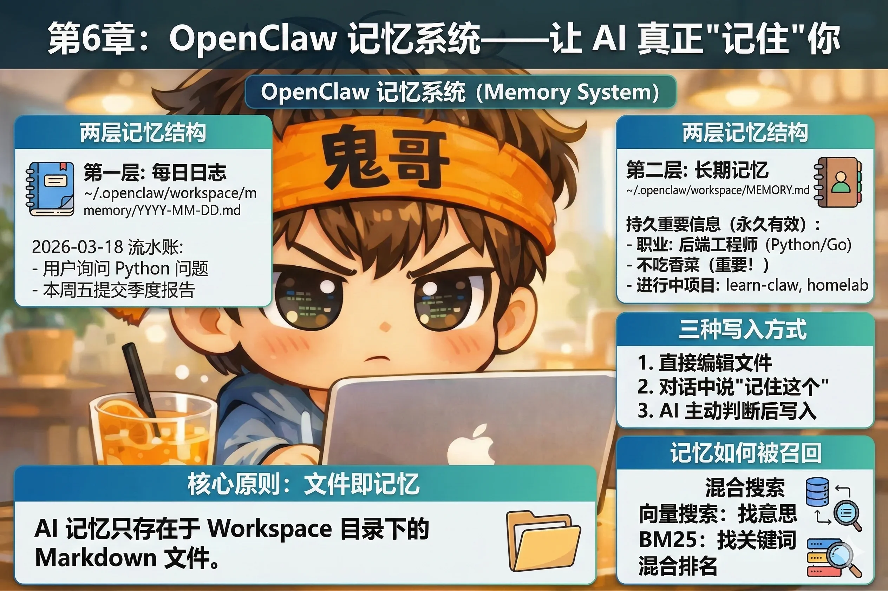

# 第6章：记忆系统——让 AI 真正"记住"你

你跟 AI 说过你不吃香菜。

两周后，你让它帮你在 DoorDash 上点外卖，它给你推荐了一道加了大量香菜的菜。

你叹了口气，再次告诉它你不吃香菜。

这个循环可以无限重复——直到你真正理解 OpenClaw 的记忆系统是怎么工作的。



---

## 核心原则：文件即记忆

OpenClaw 的记忆系统建立在一个极其简单的原则上：

**AI 能记住的，只有写进文件的。文件里没有的，它就不知道。**

没有隐形数据库，没有神秘的"学习过程"，没有后台偷偷积累的用户画像。记忆就是 Workspace 目录里的 Markdown 文件，完全透明，完全可控。

这个设计的好处是：你随时知道 AI "记住了什么"——打开文件看一眼就行。要删除某条记忆？删掉那行文字。要修改？直接编辑。没有任何黑盒。

---

## 两层记忆结构

OpenClaw 的记忆分两层，用途不同，各司其职。

### 第一层：每日日志（`memory/YYYY-MM-DD.md`）

`~/.openclaw/workspace/memory/` 目录下，每天会生成一个以日期命名的文件，比如 `2026-03-18.md`。这是当天的流水账——追加写入，记录这一天发生的事：

```markdown
# 2026-03-18

- 用户询问了关于 Python 异步编程的问题，解决了 asyncio 的一个坑
- 用户提到本周五要提交季度报告，需要数据汇总
- 用户说想试试把 Gateway 部署到树莓派上
```

Gateway 默认会在每次会话开始时读取**今天和昨天**的日志，作为近期上下文。

类比：**每日日志是日记本**。记的是今天发生的事，时效性强，不需要精心整理。

### 第二层：长期记忆（`MEMORY.md`）

`MEMORY.md` 是精心维护的长期记忆库，存放那些需要**永久有效**的事实：

```markdown
# 关于我

## 基本信息
- 职业：后端工程师，Python / Go 技术栈
- 时区：Asia/Shanghai
- 不吃香菜（重要！）

## 工作偏好
- 代码审查时直接指出问题，不需要先夸
- 部署用 Docker，不用虚拟机

## 进行中的项目
- learn-claw：正在写一本 OpenClaw 入门书
- homelab：把树莓派 4 配置成家庭服务器
```

类比：**MEMORY.md 是通讯录**。记的是持久不变的重要信息，需要你主动维护和整理。

::: tip 优先级说明
当两个文件都存在时，`MEMORY.md`（大写）的内容比 `memory.md`（小写）优先级更高。如果你手动建了一个小写版本，记得这个区别。
:::

---

## 三种写入记忆的方式

知道记忆存在哪里，下一步是怎么把东西写进去。有三种方式：

### 方式一：直接编辑文件

最简单直接。打开 `MEMORY.md`，像写普通笔记一样写。

```bash
code ~/.openclaw/workspace/MEMORY.md
```

适合：整理已有信息、批量更新、做结构化调整。

### 方式二：对话中说"记住这个"

在任何对话里，直接告诉 AI：

```
记住：我每周三下午固定有团队站会，时间是 3 点到 3 点半。
```

AI 会把这条信息写入 `MEMORY.md` 或当天的日志——就在对话里，你会看到它确认"已记录"。

这就像有个秘书坐在旁边。你得亲口告诉他"把这件事记下来"，他才会记。不然他以为你只是随口聊聊，聊完就忘了。

### 方式三：AI 主动判断后写入

你不说"记住"，但 AI 认为某件事值得记，它也会主动写入。

触发条件通常在 `AGENTS.md` 里定义，比如：

```markdown
## 记忆规则
遇到以下情况，主动写入 MEMORY.md：
- 用户明确表达的长期偏好
- 重要的项目决策
- 用户提到的个人信息（时区、职业等）
```

这是最"智能"的方式，但也最不可控——如果你发现 MEMORY.md 里出现了你不想记的内容，直接删掉就行。

---

## 记忆如何被召回

写入是一回事，用的时候能不能找到是另一回事。

如果你已经积累了几个月的记忆文件，总字数可能有几万字。AI 不可能每次都把全部内容塞进上下文——那样既慢又贵。OpenClaw 用**混合搜索**来找出最相关的片段。

### 向量搜索：找意思

向量搜索把每段文字转化成一组数字（向量），意思相近的文字，数字也相近。

当 AI 需要查记忆时，它把你的问题也转成向量，然后找和它最接近的记忆片段——不需要关键词完全匹配，找的是**语义相似性**。

类比：你问"我之前说过不喜欢吃什么？"——向量搜索能找到"不吃香菜"这条记忆，即使你的问题里没有出现"香菜"这个词。

### BM25：找关键词

BM25 是传统的关键词匹配算法，擅长找精确的词：函数名、变量名、项目代号、人名。

类比：向量搜索是"找意思"，BM25 是"找字"。两者互补——有时候你就是要找那个精确的词，向量搜索反而会找错。

### 混合排名

两种结果合并，加权排名，取最相关的几条片段注入上下文。这就是 AI 每次对话里"记住"你说过的事的底层机制。

::: info 嵌入模型配置
向量搜索需要一个**嵌入模型**把文字转成向量。OpenClaw 会按优先级自动选择：本地模型 → OpenAI → Gemini → 其他。

如果你已经配了 OpenAI 或 Anthropic 的 API Key，嵌入模型通常会自动启用，不需要额外配置。记忆索引存在 `~/.openclaw/memory/<agentId>.sqlite`。
:::

---

## 高级特性速览

记忆系统还有两个值得了解的特性，现在不用深入配置，知道它们存在就够了。

### 时间衰减

越新的记忆，在搜索结果里权重越高。三天前说的事比三个月前说的事更可能被召回。

有一个例外：`MEMORY.md` 和没有日期前缀的文件被认为是"常青内容"，不会衰减——它们永远保持高权重。这也是为什么重要的长期信息要放 `MEMORY.md` 而不是日志文件。

### MMR 去重

MMR（Maximal Marginal Relevance）解决一个实际问题：如果你某天连续聊了十条关于同一个项目的消息，搜索结果可能会召回这十条高度重复的内容，挤占了其他有用信息的位置。

MMR 在保证相关性的同时，主动引入多样性——简单说，已经召回了一条"关于 learn-claw 项目"的记忆，下一条就尽量找主题不同的，而不是再来一条几乎一样的。

### 上下文压缩前的自动记忆刷新

每次对话都会消耗上下文空间（Token），聊得越长越接近上限。当对话接近上限时，OpenClaw 会触发一个静默机制：**在压缩上下文之前，先让 AI 把重要信息写进记忆文件**。

就像学生在考试卷发下来之前，把关键公式抄在草稿纸上——确保即使"脑容量"被清空，重要的东西不会丢失。

这个过程是自动的，你通常感觉不到它。

---

## 动手练习

现在来验证记忆系统真的在工作。

**第一步**：开一个新对话，告诉 AI 一件你希望它记住的事：

```
记住：我目前在做一个叫 learn-claw 的项目，
是一本 OpenClaw 入门书，大约有 18 章，
现在写到第6章了。
```

确认 AI 说它已经记录了。

**第二步**：关闭这个对话（或者发送 `/new` 开一个全新的会话），然后问：

```
我现在在做什么项目？进展到哪了？
```

如果 AI 能准确回答，说明记忆系统正常工作。

**第三步**：打开 `~/.openclaw/workspace/MEMORY.md`，找到刚才 AI 写入的内容，看看它是怎么记录的。

---

::: tip 本章检查清单
- [ ] 你能说出每日日志和 MEMORY.md 的区别吗？（提示：日记本 vs 通讯录）
- [ ] 你让 AI 记住了一件事，并在新对话里验证它确实记住了吗？
- [ ] 你知道如果想删除某条记忆，应该怎么做吗？
:::
