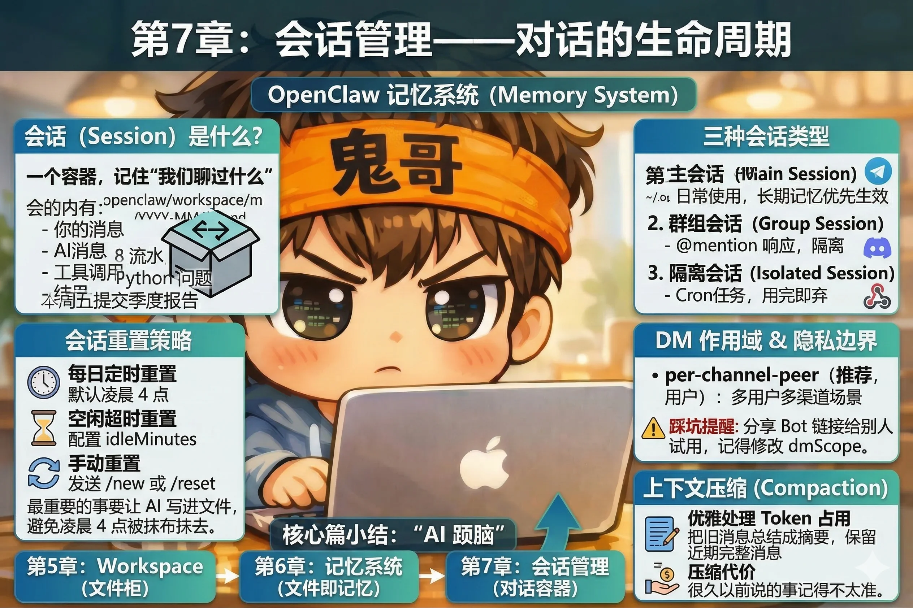

# 第7章：会话管理——对话的生命周期

你和 AI 的每一次对话，都不是凭空发生的——它发生在一个叫做**会话（Session）**的容器里。

会话负责记住"我们聊过什么"：你说了什么、AI 说了什么、调用了什么工具、得到了什么结果。没有会话，AI 每条消息都是独立的，完全不知道上下文。

这一章，我们搞清楚会话是如何创建、如何运转、何时消亡的——以及你能怎么控制它。



---

## 三种会话类型

OpenClaw 里有三种会话，针对不同的使用场景：

### 主会话（Main Session）

你的私信（DM）默认都落在主会话里。不管你从 Telegram 发消息还是从 WhatsApp 发消息，默认都是同一个主会话——AI 知道这些消息都来自"你"。

主会话是你日常使用最多的会话，也是 Workspace 文件、长期记忆优先生效的地方。

### 群组会话（Group Session）

当 AI 被加入一个群组（Telegram 群、Discord 频道、WhatsApp 群），群组里的对话会形成独立的会话，和主会话完全隔离。

群组会话里，AI 通常需要被 @ 提及才会响应，避免"旁听"所有消息都回复。

### 隔离会话（Isolated Session）

Cron 定时任务、Webhook 触发的任务，每次运行在独立的隔离会话里，用完即弃，不会污染主会话的上下文。这是第11、12章的内容，现在知道它存在就行。

---

## 会话重置策略

会话不是永久存在的。OpenClaw 提供了几种重置机制，清空上下文、以全新状态开始。

### 每日定时重置

默认配置下，主会话每天**凌晨 4 点**自动重置。

就像你的老板每天早上上班前把白板擦干净——好处是每天都是全新的开始，上下文干净清爽；代价是昨天在对话里提到但没有写进记忆文件的事，今天就真的没了。

这就是为什么第6章反复强调"重要的事要让 AI 写进文件"——凌晨 4 点那把抹布不管什么有没有价值，一律清空。

::: tip 修改重置时间
如果凌晨 4 点不合适（比如你经常熬夜到很晚），可以在配置文件里修改：

```json
{
  "agents": {
    "defaults": {
      "session": {
        "reset": {
          "hour": 5,
          "minute": 0
        }
      }
    }
  }
}
```
:::

### 空闲超时重置

除了定时重置，还可以配置空闲重置：超过一定时间没有对话，自动重置会话。

```json
{
  "agents": {
    "defaults": {
      "session": {
        "reset": {
          "idleMinutes": 120
        }
      }
    }
  }
}
```

两种重置同时配置时，**哪个先到哪个生效**。

### 手动重置

随时在对话里发送：

```
/new
```

立即开始一个全新的会话，之前的上下文清空。适合：话题彻底切换、觉得 AI 被之前的对话"带歪"了、想要一个干净的起点。

`/reset` 效果相同。

---

## DM 作用域：多用户场景的隐私边界

默认配置下，所有发往同一个 Bot 的私信都共享同一个主会话。这在**你是唯一用户**的情况下完全没问题。

但如果你把 Bot 分享给了家人或朋友，或者在工作中给团队成员用，就会出现一个严肃的问题：

**用户 A 和用户 B 共享同一个上下文，彼此能看到对方聊过的内容。**

这不是设计缺陷，是默认配置的适用场景不同。解决方法是修改 `session.dmScope`：

```json
{
  "agents": {
    "defaults": {
      "session": {
        "dmScope": "per-channel-peer"
      }
    }
  }
}
```

四种 `dmScope` 模式对比：

| 模式 | 含义 | 适用场景 |
|---|---|---|
| `main`（默认）| 所有 DM 共享一个会话 | 只有你自己用 |
| `per-peer` | 按发送者隔离 | 多人共用，但跨渠道同一人共享 |
| `per-channel-peer` | 按渠道+发送者隔离 | 多人共用，推荐配置 |
| `per-account-channel-peer` | 按账号+渠道+发送者隔离 | 多账号多渠道复杂场景 |

::: warning 踩坑提醒
如果你曾经把 OpenClaw 的 Bot 链接发给别人试用，记得检查 `dmScope` 的配置。`main` 模式下，你们的对话上下文是混在一起的。
:::

---

## 上下文压缩：AI 的"遗忘机制"

每次对话消耗上下文空间（Token）。聊得越久，占用越多；占满了，最早的消息会被丢弃。

OpenClaw 用**上下文压缩（Compaction）**来优雅地处理这个问题：不是粗暴地丢弃旧消息，而是**把旧消息总结成摘要**，保留近期的完整消息。

想象一个速记员在记会议纪要。会议开了一个小时后，他意识到本子快写满了——于是他把前半段的内容压缩成一页摘要，腾出空间继续记后半段。细节可能丢失了，但主线还在。

这解释了一个常见现象：**和 AI 聊了很久之后，它对很早以前说的事记得不太准了**。不是 Bug，是压缩带来的代价。

对策还是那句话：重要的事写进记忆文件。压缩摘要里可能丢失"你两个小时前随口说的那件事"，但写进 `MEMORY.md` 的内容每次对话都会重新注入，永远不会被压缩掉。

---

## 实用命令速览

几个和会话直接相关的命令，随时可以用：

**查看当前会话状态：**
```
/status
```
返回当前会话的 Token 使用量、会话 ID、上次重置时间。感觉 AI"状态不对"时，先跑这个看一眼。

**查看上下文构成：**
```
/context list
```
显示当前上下文里有什么：Workspace 文件贡献了多少 Token，对话历史占了多少，各个技能又占了多少。诊断"为什么 Token 用得这么多"的利器。

**开启新会话：**
```
/new
```

**中断当前运行：**
```
/stop
```
AI 正在执行一个耗时任务（比如浏览器操作），想强制停止时用这个。

---

## 动手练习

做一个简单的状态检查：

在 Web Dashboard 或任意渠道里，发送：

```
/status
```

观察输出，找到这几个信息：
- 当前 Token 使用量是多少？占上限的百分比？
- 会话 ID 是什么格式？
- 上次重置是什么时候？

然后发送 `/new`，再跑一次 `/status`——你会看到 Token 使用量归零，会话 ID 变成了一个新的值。

这就是会话重置的直观体现。

---

## 核心篇小结

第5、6、7 章，我们一起走完了 OpenClaw 最核心的三个概念：

- **Workspace**：AI 的文件柜，性格、规范、工具备忘录都在这里，普通文本，随时可改
- **记忆系统**：文件即记忆，两层结构（每日日志 + 长期记忆），混合搜索召回
- **会话管理**：对话的容器，有生命周期，可以配置重置策略和隔离策略

这三个概念合在一起，构成了 OpenClaw 的"大脑"——你对 AI 的所有定制，最终都落在这里。

接下来的**能力篇**，我们来解锁 AI 的"双手"：内置工具、技能生态，以及怎么在给它能力的同时，确保它不会乱来。

---

::: tip 本章检查清单
- [ ] 你知道主会话、群组会话、隔离会话分别在什么场景下使用吗？
- [ ] 如果你的 Bot 被多个人使用，你知道应该把 `dmScope` 改成什么吗？
- [ ] 运行 `/status` 后，你能看懂输出里的 Token 使用信息吗？
:::
