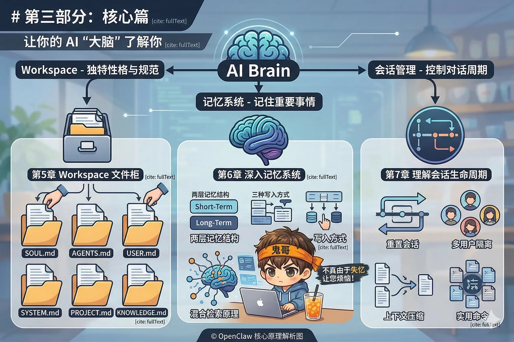

# 第三部分：核心篇

AI 跑起来了，渠道也通了。但此刻的它还像一个刚入职的员工：能干活，却对你一无所知——不知道你是谁，不知道你的偏好，今天告诉它的事明天就忘了。

这一部分解决的，正是这个问题。

OpenClaw 用三个机制让 AI 真正"了解你"：**Workspace** 定义它的性格和行为规范，**记忆系统**让它记住重要的事，**会话管理**控制对话的生命周期。三者加在一起，构成了 OpenClaw 的"大脑"。

**本部分包含三章：**

- **第5章** 打开 Workspace 文件柜，逐一认识六个核心文件（SOUL.md、AGENTS.md、USER.md 等），动手给你的 AI 一个独特的性格。
- **第6章** 深入记忆系统：两层记忆结构、三种写入方式、混合检索原理——搞懂这些，才能真正让 AI 记住你。
- **第7章** 理解会话的生命周期：何时重置、如何隔离多用户场景、上下文压缩是怎么回事，以及几个随时用得到的实用命令。
