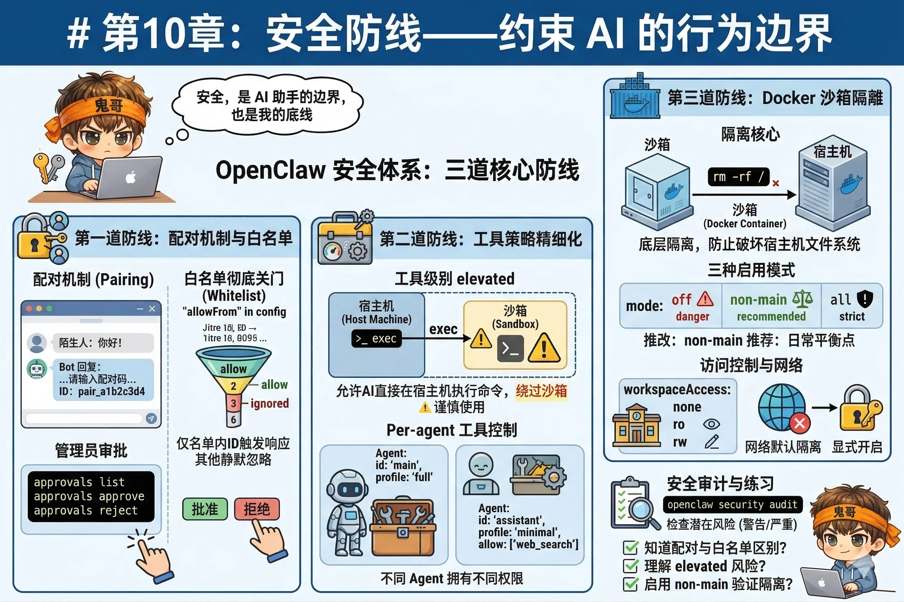

# 第10章：安全防线——约束 AI 的行为边界

前两章给 AI 装上了工具和 Skill——它现在能执行命令、控制浏览器、发送消息。

这是好事，也是坏事。

能力越大，边界越重要。一个没有约束的 AI 助手，就像把一个技术高超但没有任何规矩的员工放进你的服务器机房——大多数时候它会做对的事，但你绝对不希望在它心情不好的某天，发现它把 `/etc` 目录清理了一遍。

这一章，我们来建立 OpenClaw 的安全体系。



---

## 第一道防线：配对机制

### 陌生人发消息会发生什么

假设你把 Telegram Bot 的链接发出去了，或者有人猜到了你的 WhatsApp 备用号。他们给你的 Bot 发了一条消息——会发生什么？

默认情况下，他们会收到一串**配对码**：

```
你好！我是一个私人 AI 助手，不接受未经授权的访问。
如需使用，请提供配对码或联系管理员。
配对码请求 ID：pair_a1b2c3d4
```

这道门就是**配对机制（Pairing）**。就像有人想蹭你 WiFi，你给了他一道需要你本人确认的题，而不是直接给密码。

陌生人无法自行完成配对——他们的请求会等待你审批。你在另一端运行：

```bash
openclaw approvals list        # 查看待审批请求
openclaw approvals approve <id>  # 批准
openclaw approvals reject <id>   # 拒绝
```

### 用白名单彻底关门

配对机制是"需要审批才能进"，白名单是"非名单内的人连门都摸不到"。

在渠道配置里设置 `allowFrom`，只有名单里的号码/ID 才能触发 AI 响应：

```json
{
  "channels": {
    "whatsapp": {
      "allowFrom": ["+8613800138000", "+8613900139000"]
    },
    "telegram": {
      "allowFrom": ["123456789", "987654321"]
    }
  }
}
```

名单外的消息会被静默忽略。这是最干净的保护方式——自己用，或者只给固定的几个人用，直接白名单搞定。

---

## 第二道防线：工具策略精细化

第8章介绍了 `allow` / `deny` 和工具画像。这里补充两个进阶概念。

### elevated：突破沙箱的后门

`elevated` 工具级别允许 AI 在**宿主机**上直接执行命令，绕过后面要讲的沙箱隔离。

```json
{
  "agents": {
    "defaults": {
      "tools": {
        "elevated": ["exec"]
      }
    }
  }
}
```

这个设置的意思是：即使你启用了沙箱，`exec` 工具依然在宿主机上运行，不受沙箱限制。

::: warning 谨慎使用 elevated
`elevated` 是"紧急情况需要突破沙箱"的设计，不是日常配置。

适合用的场景：你需要 AI 操作宿主机上沙箱无法访问的资源（比如特定硬件、宿主机服务）。

不适合用的场景：懒得配沙箱，直接 elevated 省事——这等于放弃了沙箱提供的全部保护。
:::

### per-agent 工具控制

不同的 Agent 可以有不同的工具权限。第13章会讲多智能体，这里先知道这个能力存在：

```json
{
  "agents": {
    "list": [
      {
        "id": "main",
        "tools": { "profile": "full" }
      },
      {
        "id": "assistant",
        "tools": {
          "profile": "minimal",
          "allow": ["web_search"]
        }
      }
    ]
  }
}
```

主 Agent 拥有完整权限，对外开放的助理 Agent 只能用 `web_search`。

---

## 第三道防线：Docker 沙箱

配对机制和工具策略控制的是"谁能用"和"能用什么"。Docker 沙箱解决的是更底层的问题：**即使 AI 能用 exec，它的操作也被关在一个隔离的小房间里**。

就算它一时手滑运行了 `rm -rf /`，删的也是那个小房间，不是你的真实文件系统。小房间随时可以重建，你的文件安然无恙。

### 前提：安装 Docker

沙箱基于 Docker，先确保 Docker 已安装并运行：

```bash
docker --version
docker ps  # 能看到输出说明 Docker 正常运行
```

然后构建 OpenClaw 的沙箱镜像：

```bash
# 在 OpenClaw 安装目录下运行
scripts/sandbox-setup.sh
```

这会创建一个名为 `openclaw-sandbox:bookworm-slim` 的镜像，这是沙箱的基础环境。

### 三种启用模式

```json
{
  "agents": {
    "defaults": {
      "sandbox": {
        "mode": "non-main"
      }
    }
  }
}
```

三种 `mode` 值：

| 模式 | 含义 | 推荐场景 |
|---|---|---|
| `off` | 不启用沙箱 | 完全信任自己，个人使用 |
| `non-main`（推荐）| 只有非主会话走沙箱 | 日常使用的最佳平衡点 |
| `all` | 所有会话都走沙箱 | 最严格，适合对外开放的服务 |

::: tip 为什么推荐 non-main？
主会话（你自己的 DM）通常需要访问本地文件和宿主机资源，沙箱会增加摩擦。

非主会话（群组消息、Webhook 触发的任务、陌生人 DM）来源更杂，风险更高，应该在沙箱里运行。

`non-main` 模式正好在"方便"和"安全"之间取得平衡。
:::

### 沙箱作用域

`scope` 决定沙箱容器如何分配：

```json
{
  "agents": {
    "defaults": {
      "sandbox": {
        "mode": "non-main",
        "scope": "session"
      }
    }
  }
}
```

| scope | 含义 |
|---|---|
| `session`（默认）| 每个会话一个独立容器，隔离最彻底 |
| `agent` | 同一个 Agent 的所有会话共用一个容器 |
| `shared` | 所有沙箱会话共用一个容器 |

大多数情况下用默认的 `session` 就好。

### 工作区访问控制

沙箱里的 AI 默认在一个**完全隔离的工作目录**里操作，看不到你的真实 Workspace。可以用 `workspaceAccess` 调整：

```json
{
  "agents": {
    "defaults": {
      "sandbox": {
        "workspaceAccess": "ro"
      }
    }
  }
}
```

| 值 | 含义 |
|---|---|
| `none`（默认）| 沙箱有独立的隔离工作目录，看不到真实 Workspace |
| `ro` | 真实 Workspace 以只读方式挂载到沙箱的 `/agent` |
| `rw` | 真实 Workspace 以读写方式挂载到沙箱的 `/workspace` |

### 网络隔离

沙箱容器默认**完全没有出口网络**——里面的进程无法访问外部互联网。这对执行本地代码来说够用，且大幅降低了数据泄露的风险。

如果你的任务确实需要在沙箱里访问网络，需要在配置里显式开启，并仔细考虑你在放弃什么。

---

## 安全审计

配置完成后，用 OpenClaw 自带的审计工具检查一遍：

```bash
openclaw security audit
```

这个命令会扫描你当前的配置，指出潜在的安全问题，比如：

- 没有设置 `allowFrom` 白名单
- 工具策略过于宽松
- 沙箱未启用但有高风险工具
- Token 或 API Key 以明文写在配置文件里

每条问题都有严重程度标注（Warning / Critical），按提示逐条处理即可。

---

## 动手练习

开启 `non-main` 沙箱模式：

在 `~/.openclaw/openclaw.json` 里添加：

```json
{
  "agents": {
    "defaults": {
      "sandbox": {
        "mode": "non-main",
        "scope": "session"
      }
    }
  }
}
```

重启 Gateway 后，在群组会话（或者用 Webhook 触发一个任务）里，让 AI 运行：

```
执行命令：ls /
```

如果沙箱生效，AI 看到的 `/` 是容器内的文件系统，不会看到你宿主机上的真实目录结构。对比一下：在主会话（DM）里运行同样的命令，看到的是你真实的文件系统。

这就是 `non-main` 模式的效果。

---

## 能力篇小结

第8、9、10 章，我们完整地走过了"给 AI 装能力、教它用好能力、确保它不乱来"的完整闭环：

- **工具**是物理能力，exec / browser / web 是最常用的三件
- **Skill**是知识沉淀，ClawHub 提供现成的，你也可以自己写
- **安全体系**有三层：配对机制（控制谁能用）、工具策略（控制能用什么）、沙箱隔离（控制影响范围）

下一部分，**进阶篇**，我们来解锁 OpenClaw 最有意思的一面：让 AI 不只是被动响应，而是**主动工作**——定时任务、事件触发、多智能体协作，这些才是真正让 AI 成为"助手"而不是"工具"的关键。

---

::: tip 本章检查清单
- [ ] 你知道配对机制和 `allowFrom` 白名单的区别吗？（一个需要审批，一个直接拒绝）
- [ ] `elevated` 工具策略会带来什么风险？你知道什么时候才应该用它吗？
- [ ] 你已经启用了沙箱的 `non-main` 模式，并验证了它的隔离效果吗？
:::
