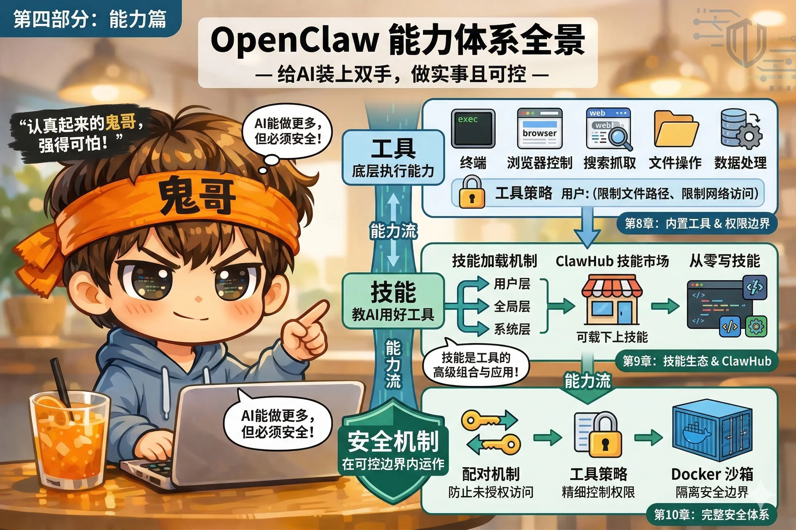

# 第四部分：能力篇

大脑有了，现在来装双手。

前三部分解决的是"AI 是谁、它记得什么、它的对话怎么管理"。这一部分解决更实际的问题：**AI 能帮你做什么，以及怎么确保它不会做坏事**。

OpenClaw 的能力体系分三层：工具提供底层执行能力，Skill 教会 AI 如何用好这些能力，安全机制确保能力在可控的边界内运作。三层缺一不可。

**本部分包含三章：**

- **第8章** 介绍 OpenClaw 的内置工具全景，重点讲解最常用的 exec（终端命令）、browser（浏览器控制）和 web（搜索抓取），以及如何用工具策略设定权限边界。
- **第9章** 讲解 Skill（Skills）生态——Skill 和工具的区别、三层加载机制、ClawHub 社区市场，以及如何从零写一个自己的 Skill。
- **第10章** 建立完整的安全体系：配对机制防止未授权访问，工具策略精细控制权限，Docker 沙箱把 AI 的操作隔离在安全边界内。
