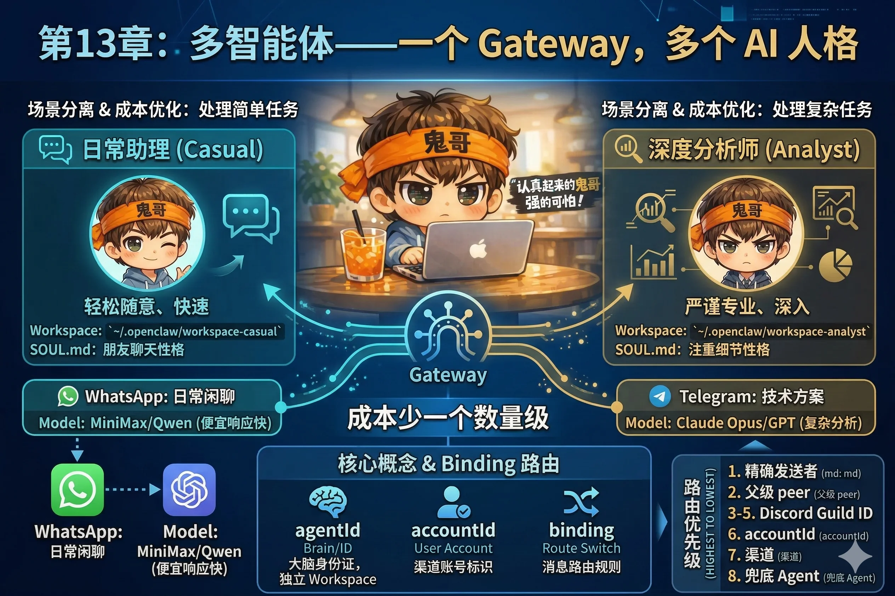

# 第13章：多智能体——一个 Gateway，多个 AI 人格

让一个 AI 人格处理所有事情，就像让一个人既当快递员又当外科医生——理论上都能做，但你真的想让同一个人在送完外卖之后直接给你做手术吗？

更实际的场景：你在 WhatsApp 上跟 AI 闲聊今天吃什么，同时在 Telegram 上请它帮你审阅一份技术方案。这两件事对 AI 的要求完全不同：一个需要轻松、快速、随意；另一个需要严谨、深入、专业。

同一个性格设定、同一个模型，很难同时做到两种截然不同的状态。

多智能体就是解法：**一个 Gateway，运行多个相互独立的 AI 人格，各司其职**。



---

## 两个驱动力

### 驱动力一：场景分离

不同的渠道、不同的任务需要不同的 AI：

- WhatsApp 日常助理：随意、快速、会聊天，Workspace 里写的是轻松的性格设定
- Telegram 深度分析：严谨、详细、工具齐全，配置了 exec 和 browser 工具
- Discord 技术机器人：只回答编程问题，其他一律拒绝

每个角色有自己独立的 Workspace（独立的 SOUL.md、MEMORY.md、AGENTS.md），完全隔离，互不影响。

### 驱动力二：成本优化

便宜的模型处理"今天吃什么"，贵的处理"帮我审这份合同"——这不是对 AI 的歧视，是合理的人力资源配置。

一个典型的搭配：
- 日常闲聊 → MiniMax 或 Qwen（成本极低，响应快）
- 复杂分析 → Claude Opus 或 GPT（效果好，但按量计费）

每个月下来，成本可以少一个数量级。

---

## 三个核心概念

在配置多智能体之前，先理清三个概念。它们是 OpenClaw 多 Agent 系统的基础。

### agentId：大脑的身份证

每个 Agent 有一个唯一的 `agentId`。它标识的是一个完整的"大脑"：

- 独立的 Workspace 目录（独立的 SOUL.md、MEMORY.md 等）
- 独立的 Auth（独立的模型凭证）
- 独立的 Session 存储（对话历史完全隔离）

两个 Agent 之间，**没有任何共享的上下文**——Agent A 完全不知道 Agent B 今天聊了什么。

### accountId：渠道账号的标识

一个渠道可以有多个账号。比如你的 WhatsApp 有两个号：个人号和工作号。每个号是一个独立的 `accountId`。

```
WhatsApp personal  →  accountId: "wa-personal"
WhatsApp biz       →  accountId: "wa-biz"
Telegram bot       →  accountId: "tg-main"
```

### binding：消息的路由规则

`binding` 把"消息从哪里来"映射到"应该由哪个 Agent 处理"。

一条 binding 的基本结构：

```json
{
  "channel": "whatsapp",
  "accountId": "wa-personal",
  "agentId": "casual"
}
```

意思是：WhatsApp 个人号收到的消息，交给 `casual` 这个 Agent 处理。

---

## Binding 的路由优先级

当一条消息进来，Gateway 按以下优先级从高到低匹配 binding：

| 优先级 | 匹配条件 | 说明 |
|---|---|---|
| 1 | 精确的发送者 ID | 特定的某个人发来的 DM |
| 2 | 父级 peer（线程继承）| 回复某条消息时，继承原消息的 Agent |
| 3 | Discord Guild ID + 角色 | Discord 里特定身份的成员 |
| 4 | Discord Guild ID | 整个 Discord 服务器 |
| 5 | Slack Team ID | 整个 Slack 工作区 |
| 6 | 渠道账号（accountId）| 特定账号收到的所有消息 |
| 7 | 渠道（channel）| 来自特定渠道的所有消息 |
| 8 | 兜底默认 Agent | `agents.defaults` 配置 |

**同一优先级有多条 binding 匹配时，取配置文件里排在前面的那条。**

这意味着你可以做非常精细的控制：比如同一个 WhatsApp 号，来自你老婆的消息路由给"家庭助理 Agent"，来自你老板的消息路由给"工作助理 Agent"，其余的消息走默认 Agent。

---

## 典型配置示例

来看一个完整可用的配置，实现：
- WhatsApp → 日常助理（便宜模型，轻松性格）
- Telegram → 深度分析师（Opus 模型，严谨性格）

**第一步：创建两个独立的 Workspace**

```bash
# 日常助理的 Workspace
mkdir -p ~/.openclaw/workspace-casual
cat > ~/.openclaw/workspace-casual/SOUL.md << 'EOF'
## 性格
轻松随意，像朋友聊天。回复简短，不废话。
EOF

# 深度分析师的 Workspace
mkdir -p ~/.openclaw/workspace-analyst
cat > ~/.openclaw/workspace-analyst/SOUL.md << 'EOF'
## 性格
严谨专业，注重细节。回复结构清晰，有理有据。
遇到复杂问题时，先分解问题再逐步分析。
EOF
```

**第二步：更新 openclaw.json**

```json
{
  "agents": {
    "list": [
      {
        "id": "casual",
        "workspace": "~/.openclaw/workspace-casual",
        "model": {
          "primary": "minimax/abab6.5s-chat"
        }
      },
      {
        "id": "analyst",
        "workspace": "~/.openclaw/workspace-analyst",
        "model": {
          "primary": "anthropic/claude-opus-4-6"
        },
        "tools": {
          "profile": "coding"
        }
      }
    ]
  },
  "bindings": [
    {
      "channel": "whatsapp",
      "agentId": "casual"
    },
    {
      "channel": "telegram",
      "agentId": "analyst"
    }
  ],
  "channels": {
    "whatsapp": {
      "allowFrom": ["+8613800138000"]
    },
    "telegram": {
      "token": "your-telegram-token"
    }
  }
}
```

重启 Gateway，两个独立的 AI 就都跑起来了。

::: tip 没有两个渠道怎么办？
只有一个渠道也能测试多 Agent：用 Web Dashboard 测试一个 Agent，用 Telegram 测试另一个。或者配置两个 Telegram Bot，绑定不同的 Agent。
:::

---

## per-Agent 权限控制

多 Agent 场景下，每个 Agent 可以有完全独立的工具策略和沙箱配置：

```json
{
  "agents": {
    "list": [
      {
        "id": "casual",
        "tools": {
          "profile": "minimal"
        },
        "sandbox": {
          "mode": "all"
        }
      },
      {
        "id": "analyst",
        "tools": {
          "profile": "coding",
          "allow": ["browser"]
        },
        "sandbox": {
          "mode": "non-main"
        }
      }
    ]
  }
}
```

对外开放的 `casual` Agent 用最严格的限制：`minimal` 工具画像 + 全面沙箱。`analyst` Agent 只有你自己用，给了 `coding` 画像加 `browser` 工具。

这是多 Agent 架构最大的安全优势：**不同信任级别的 Agent，给不同的权限边界**，一刀切的全局配置永远无法做到这种精细程度。

---

## 动手练习

按照上面的典型配置示例，完成以下步骤：

1. 创建两个 Workspace 目录，写入不同风格的 SOUL.md
2. 在 `openclaw.json` 里配置两个 Agent，绑定到不同渠道
3. 重启 Gateway，确认两个 Agent 都正常运行：

```bash
openclaw gateway status
```

4. 发同一个问题给两个渠道：

```
你好，能简单介绍一下你自己吗？
```

观察两个 Agent 的回复风格——即使模型相同，不同的 SOUL.md 也会产生截然不同的回答风格；如果模型也不同，差异会更加明显。

---

::: tip 本章检查清单
- [ ] 你能说清楚 agentId、accountId、binding 三者的关系吗？
- [ ] 你知道当一条消息同时匹配多条 binding 时，Gateway 如何决定用哪条吗？
- [ ] 你配置了两个 Agent，并验证了它们的回复风格确实不同吗？
:::
