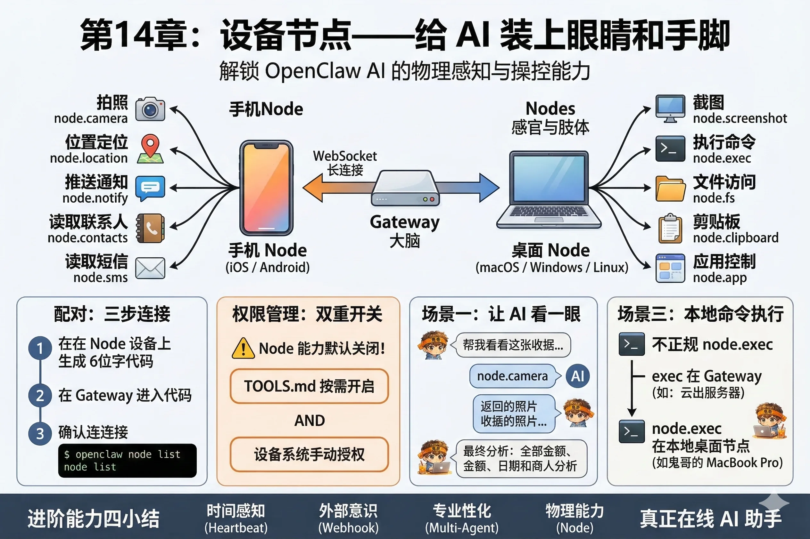

# 第14章：设备节点——给 AI 装上眼睛和手脚

想象一下，一个聪明绝顶的大脑，被装在一个密封的玻璃罐子里。

它能帮你分析股票、写代码、规划旅行——但它感知世界的唯一方式，就是你打进去的文字。你说"今天天气不错"，它信了；你说"我家门口来了一只奇怪的动物"，它只能靠想象。

这就是没有设备节点的 OpenClaw：大脑在线，感官缺席。

设备节点（Node）解决的就是这个问题：**把你的手机和电脑配对成 AI 的感官和肢体**。接上之后，AI 可以让手机拍张照片，可以要电脑截个屏，可以读取你的位置，可以在本地执行命令——它终于有了接触物理世界的能力。



---

## Node 是什么

Node 是一个运行在你设备上的轻量客户端（App 或后台程序），它和 Gateway 之间保持一条持久的 WebSocket 连接。

```
你的手机（Node）
      ↕ WebSocket 长连接
Gateway（大脑）
      ↕
AI 模型
```

每当 AI 需要调用设备能力时，Gateway 通过这条连接向 Node 发指令，Node 执行后把结果返回。整个过程对你来说透明——你问 AI "帮我看看桌上那张纸写的什么"，AI 调 Node 拍张照，分析，给你答案。

一台 Gateway 可以同时连多个 Node，比如同时连着你的 iPhone 和你的 MacBook，各司其职。

---

## 配对：三步连接

Node 和 Gateway 的连接需要先完成**一次性配对**，之后就会自动重连，不需要每次手动操作。

**第一步：生成配对码**

在安装了 Node 的设备上，打开 Node 应用，点击「连接到 Gateway」，它会显示一个 6 位配对码，比如 `847291`。

**第二步：在 Gateway 侧输入**

```bash
openclaw node pair --code 847291
```

或者在 Web Dashboard 的「设备节点」页面输入配对码。

**第三步：确认连接**

```bash
openclaw node list
```

成功后你会看到类似：

```
ID          名称            类型      状态      最后在线
node-a1b2   My iPhone 15    mobile    在线      刚刚
node-c3d4   MacBook Pro     desktop   在线      刚刚
```

配对信息持久保存，Gateway 重启后 Node 会自动重连。

---

## 能力矩阵

不同类型的 Node 提供不同的能力。

### 手机 Node（iOS / Android）

| 能力 | 工具调用 | 说明 |
|---|---|---|
| 拍照 | `node.camera` | 调用摄像头拍一张照片 |
| 位置定位 | `node.location` | 获取当前 GPS 坐标 |
| 推送通知 | `node.notify` | 在设备上弹出系统通知 |
| 读取联系人 | `node.contacts` | 搜索通讯录（需授权） |
| 读取短信 | `node.sms` | 读取收件箱（仅 Android） |

### 桌面 Node（macOS / Windows / Linux）

| 能力 | 工具调用 | 说明 |
|---|---|---|
| 截图 | `node.screenshot` | 截取当前屏幕 |
| 执行命令 | `node.exec` | 在本地 shell 执行命令 |
| 文件访问 | `node.fs` | 读写本地文件系统 |
| 剪贴板 | `node.clipboard` | 读取或写入剪贴板内容 |
| 应用控制 | `node.app` | 打开、关闭、激活应用程序 |

::: warning 权限需要手动授权
Node 能力默认全部关闭，在 `TOOLS.md` 里按需开启，同时设备本身也需要给 Node 应用授予对应的系统权限（相机、位置、联系人等）。这是两道独立的开关——缺一道都不会工作。
:::

---

## 在 TOOLS.md 里启用 Node 工具

Node 能力属于 `nodes` 工具组，需要在 Workspace 的 `TOOLS.md` 里显式列出：

```markdown
# 工具配置

## 启用的工具组

- runtime
- web
- nodes

## Node 工具配置

允许使用以下 Node 能力：
- node.camera（仅限已配对的手机）
- node.location
- node.screenshot（仅限已配对的桌面）
- node.notify
```

如果你有多个 Node，可以用 `nodeId` 指定哪个设备提供哪种能力，防止 AI 搞混：

```markdown
## Node 工具配置

- node.camera: node-a1b2（My iPhone 15）
- node.screenshot: node-c3d4（MacBook Pro）
```

---

## 场景一：让 AI 看一眼桌上的东西

最直观的用法：让手机 Node 拍张照，AI 分析图里的内容。

```
你（Telegram）：帮我看看桌上这张收据，总金额是多少？

AI：好的，我来用你的手机拍一张。
    [调用 node.camera → 拍照 → 返回图片]
    收据显示总金额为 ¥386.50，商户是「顺丰超市」，日期 2026 年 3 月 18 日。
```

AI 自己决定要拍照，自己发出指令，自己分析结果，最后只给你一个干净的答案。

整个过程你除了开口问，什么都不用做——包括不需要手动拍照、不需要上传图片。

---

## 场景二：监控桌面，发现问题主动告诉你

结合 Heartbeat（第11章），可以让桌面 Node 定期截图，AI 检查是否有需要注意的情况：

```markdown
# HEARTBEAT.md

每次心跳：
1. 截取桌面截图（node.screenshot）
2. 检查是否有报错弹窗、构建失败通知、或需要操作的系统提示
3. 如果发现异常，把截图和描述发送给我；如果一切正常，保持沉默
```

这相当于给 AI 安了一双眼睛，一直盯着你的屏幕——但只在出问题的时候叫你，而不是每 30 分钟截图发给你看（那就变成噪音了）。

---

## 场景三：本地命令执行

桌面 Node 的 `node.exec` 能力让 AI 可以在你的本地机器上执行 shell 命令，这比第8章里的 `exec` 工具更进一步：

- `exec` 工具：在 Gateway 所在的机器上执行（可能是服务器）
- `node.exec`：在你指定的本地桌面 Node 上执行（你的开发机）

```
你：帮我看看我的 MacBook 上 ~/projects 目录有哪些项目

AI：[调用 node.exec → ls ~/projects]
    你目前有 7 个项目：
    - learn-claw（最近修改：今天）
    - my-blog（最近修改：3天前）
    ...
```

::: tip 沙箱隔离依然有效
Node 能力受到 Workspace 里 `sandbox` 配置的约束。如果你配置了沙箱模式，`node.exec` 执行的命令也会在相应的限制下运行。不会因为是"本地"执行就绕过安全约束。
:::

---

## 多 Node 场景：手机 + 电脑协同

最有意思的场景，是两个 Node 配合起来：

```
你（WhatsApp）：帮我把电脑屏幕上显示的代码，推送到手机上提醒我

AI：好的。
    [node.screenshot → MacBook Pro 截图]
    [node.notify → iPhone 15 推送通知，附带截图预览]
    已经截好图，并推送到你的 iPhone 了。
```

AI 在两台设备之间协调，你一个指令，它两头跑。

---

## 动手练习

**准备**：在你的手机或电脑上安装 OpenClaw Node 应用（在官网下载页可以找到对应平台的版本）。

**第一步**：完成配对

按照本章的三步流程，把 Node 连接到你的 Gateway。用 `openclaw node list` 确认设备出现在列表里，状态为「在线」。

**第二步**：在 TOOLS.md 里启用一个 Node 能力

根据你配对的设备类型，选择一个能力启用：
- 手机：`node.camera` 或 `node.notify`
- 桌面：`node.screenshot`

**第三步**：测试

发送一条消息给 AI，让它使用你刚启用的能力：

```
# 如果是手机 Node
帮我拍张照，看看我桌上有什么东西

# 如果是桌面 Node
截一张当前桌面的截图，简单描述一下屏幕上显示的内容
```

观察 AI 是否成功调用了设备能力，并给出了基于真实感知的回答。

---

::: tip 本章检查清单
- [ ] 你知道 Node 和 Gateway 之间是怎么建立连接的吗？（配对码 + WebSocket）
- [ ] 你知道启用 Node 能力需要在哪两个地方授权吗？（TOOLS.md + 设备系统权限）
- [ ] 你成功配对了至少一个 Node，并验证了它的某项能力正常工作吗？
:::

---

## 进阶篇：小结

走到这里，你已经掌握了 OpenClaw 最能体现「主动性」的四个能力：

- **第11章**：Heartbeat + Cron，AI 有了时间感，会主动找你
- **第12章**：Webhook，外部世界发生变化时能第一时间叫醒 AI
- **第13章**：多 Agent，一个 Gateway 里多个 AI 人格各司其职
- **第14章**：设备节点，AI 长出了手脚，能感知和操控物理世界

这四章合在一起，描绘的是同一幅图景：一个真正「在线」的 AI 助手——不只是等你发消息，而是主动地、持续地、有感知地陪着你工作和生活。

下一部分是实战篇，我们会把学过的所有能力组合起来，从头到尾做出四个真实可用的项目。
