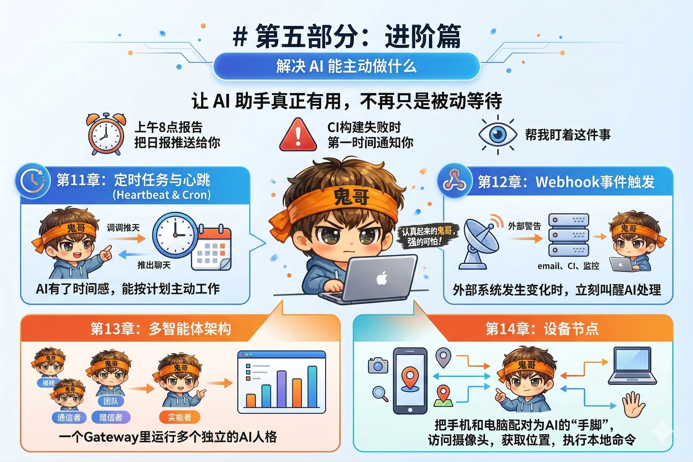

# 第五部分：进阶篇

能力篇解决的是"AI 能做什么"，进阶篇解决的是"AI 能主动做什么"。

一个真正有用的 AI 助手，不应该只是等你开口。它应该在每天早上 8 点把日报推送给你，在 CI 构建失败时第一时间通知你，在你说"帮我盯着这件事"后真的一直盯着——不需要你反复提醒，不需要你一直坐在键盘前。

这一部分的四章，覆盖了 OpenClaw 最能体现"主动性"的能力：

**本部分包含四章：**

- **第11章** 讲解 Heartbeat 心跳和 Cron 定时任务——AI 有了自己的时间感，能按计划主动工作，把结果推送到你的聊天渠道。
- **第12章** 讲解 Webhook 事件触发——外部系统（邮件、CI、监控）发生变化时，立刻叫醒 AI 处理，而不是等到下一个定时周期。
- **第13章** 讲解多智能体架构——一个 Gateway 里运行多个独立的 AI 人格，按渠道、按发送者、按场景路由消息，各司其职。
- **第14章** 讲解设备节点——把手机和电脑配对为 AI 的"手脚"，赋予它访问摄像头、获取位置、执行本地命令的物理能力。
