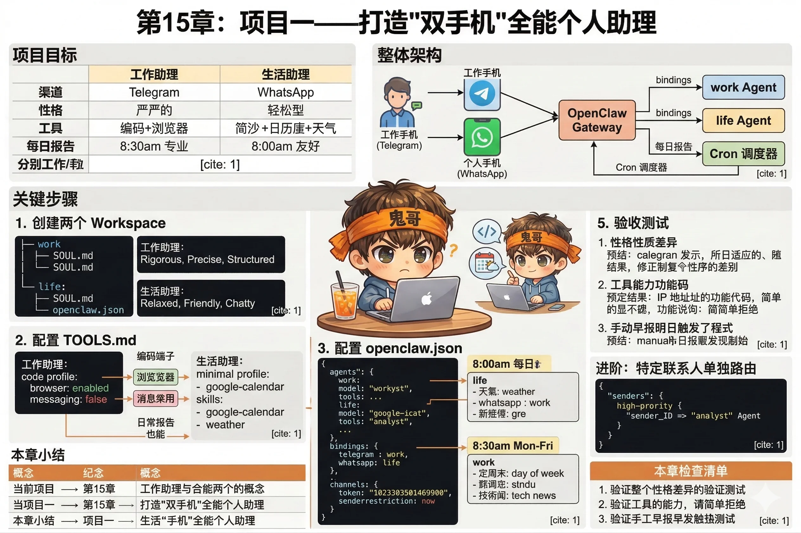

# 第15章：项目一——打造"双手机"全能个人助理

前面十四章，你学了一堆概念：Workspace、记忆系统、会话管理、工具、Skill、多 Agent、Webhook、Node……

是时候把这些拼在一起，做出一个真正能用的东西了。

这一章的项目是**双手机全能个人助理**：一个工作号，一个生活号，背后共享一个 Gateway，各自对接独立的 AI 人格。工作手机发消息，得到的是严谨专业的回答；个人手机发消息，得到的是随意轻松的回答。两台手机每天早上各自收到一份定制早报。



---

## 项目目标

完成本章后，你将拥有：

| | 工作助理 | 生活助理 |
|---|---|---|
| **渠道** | Telegram（模拟工作号） | WhatsApp |
| **性格** | 严谨、精确、有条理 | 轻松、友好、会聊天 |
| **工具** | coding 画像 + browser | minimal 画像 + 日历 Skill |
| **早报** | 每天 8:30 推送工作摘要 | 每天 8:00 推送生活摘要 |
| **记忆** | 独立 Workspace | 独立 Workspace |

两个 Agent，一个 Gateway，互不干扰。

---

## 整体架构

```
你的两台手机
  ├── 工作手机（Telegram Bot）
  │       ↓ binding: channel=telegram → agentId=work
  └── 个人手机（WhatsApp）
          ↓ binding: channel=whatsapp → agentId=life

                 ↓
           OpenClaw Gateway
          ┌──────┬──────────┐
          │      │          │
        work   life    Cron 调度器
        Agent  Agent   ├─ 8:00 → life Agent → WhatsApp
          │      │     └─ 8:30 → work Agent → Telegram
       工作区   生活区
    workspace  workspace
```

---

## 第一步：创建两个 Workspace

```bash
# 工作助理 Workspace
mkdir -p ~/.openclaw/workspace-work

cat > ~/.openclaw/workspace-work/SOUL.md << 'EOF'
## 身份

你是一位专业的工作助理。

## 性格

- 回答准确、简洁，避免废话
- 用结构化格式（列表、代码块）组织信息
- 遇到技术问题，给出可执行的具体方案，而不是模糊的建议
- 不主动寒暄，直接进入正题

## 工作风格

- 代码问题：给出可运行的代码，附上简短说明
- 文档/方案：用 Markdown 格式，层次清晰
- 如果问题不清楚，先确认需求再回答
EOF

# 生活助理 Workspace
mkdir -p ~/.openclaw/workspace-life

cat > ~/.openclaw/workspace-life/SOUL.md << 'EOF'
## 身份

你是一位贴心的生活助理，像一个知心朋友。

## 性格

- 轻松随意，不端着
- 适当幽默，但不过分
- 关心细节，记得用户说过的事情
- 回复不必太长，够用就好

## 工作风格

- 日常问题：口语化回答，简短直接
- 需要帮助时：先表示理解，再提供建议
- 闲聊时：自然接话，不要每次都转向"我能帮你做什么"
EOF
```

---

## 第二步：配置 TOOLS.md

给工作助理更强的工具能力，给生活助理保持轻量：

```bash
cat > ~/.openclaw/workspace-work/TOOLS.md << 'EOF'
# 工具配置

工具画像：coding

## 额外启用

- browser（用于查阅技术文档）

## 禁用

- messaging（工作场景不需要代发消息）
EOF

cat > ~/.openclaw/workspace-life/TOOLS.md << 'EOF'
# 工具配置

工具画像：minimal

## Skill

- google-calendar（查看和创建日程）
- weather（查询天气）
EOF
```

---

## 第三步：配置 openclaw.json

这是核心配置，把两个 Agent 和对应的渠道绑定起来：

```json
{
  "agents": {
    "list": [
      {
        "id": "work",
        "workspace": "~/.openclaw/workspace-work",
        "model": {
          "primary": "anthropic/claude-sonnet-4-6"
        },
        "tools": {
          "profile": "coding",
          "allow": ["browser"]
        }
      },
      {
        "id": "life",
        "workspace": "~/.openclaw/workspace-life",
        "model": {
          "primary": "minimax/abab6.5s-chat"
        },
        "tools": {
          "profile": "minimal"
        }
      }
    ],
    "defaults": "life"
  },
  "bindings": [
    {
      "channel": "telegram",
      "agentId": "work"
    },
    {
      "channel": "whatsapp",
      "agentId": "life"
    }
  ],
  "channels": {
    "telegram": {
      "token": "your-telegram-bot-token"
    },
    "whatsapp": {
      "allowFrom": ["+86138XXXXXXXX"]
    }
  }
}
```

::: tip 只有一个渠道？
没有两台手机也没关系——用 Telegram + Web Dashboard 分别测试两个 Agent：

```json
"bindings": [
  { "channel": "telegram", "agentId": "work" },
  { "channel": "web", "agentId": "life" }
]
```

Telegram 测试工作助理，Web Dashboard 测试生活助理，效果完全一样。
:::

---

## 第四步：添加 Cron 早报任务

两个 Agent 各自收到适合自己场景的早报：

```bash
# 生活助理早报（8:00，个人手机）
openclaw cron add \
  --name "生活早报" \
  --cron "0 8 * * *" \
  --timezone "Asia/Shanghai" \
  --session isolated \
  --agent life \
  --message "生成今天的生活早报，包含：
1. 今天的日期和天气概况（如果有天气工具）
2. 今天的日程提醒（如果有日历工具）
3. 一句轻松的早安问候
控制在 150 字以内，口语化风格。" \
  --announce \
  --channel whatsapp

# 工作助理早报（8:30，工作手机）
openclaw cron add \
  --name "工作早报" \
  --cron "30 8 * * 1-5" \
  --timezone "Asia/Shanghai" \
  --session isolated \
  --agent work \
  --message "生成今天的工作早报，包含：
1. 今天是周几，距离周末还有几天
2. 今天的工作日程（如果有日历工具）
3. 如果有 web 工具，简要列出今日科技/开发领域重要动态（2条）
格式简洁，用列表，不超过 200 字。" \
  --announce \
  --channel telegram
```

注意工作早报用了 `0-5`（周一至周五），周末不打扰。

---

## 第五步：验收测试

重启 Gateway：

```bash
openclaw gateway restart
openclaw gateway status
```

确认两个 Agent 都处于运行状态。

**测试一：性格差异**

分别向两个渠道发同一句话：

```
帮我推荐一部好看的电影
```

- Telegram（工作助理）：应该给一个结构化列表，注明类型、评分、推荐原因
- WhatsApp（生活助理）：应该随意地聊几句，像朋友推荐

**测试二：工具能力差异**

向工作助理发：

```
帮我写一个 Python 函数，判断一个字符串是否是有效的 IPv4 地址
```

它应该给出完整的代码和测试用例。

向生活助理发同样的请求——它应该坦诚地说自己不擅长代码，或者给出更简单的回答（工具画像限制了它的代码能力）。

**测试三：早报**

手动触发一次，不等明天早上：

```bash
# 查看任务 ID
openclaw cron list

# 立即触发生活早报
openclaw cron run --id <life-morning-id>

# 立即触发工作早报
openclaw cron run --id <work-morning-id>
```

检查两个渠道是否收到了风格完全不同的早报。

---

## 进阶：给特定联系人单独路由

你的工作手机上，有一个特别重要的客户，你希望它的消息被更高级的模型处理：

```json
{
  "bindings": [
    {
      "channel": "telegram",
      "senderId": "特定客户的TelegramID",
      "agentId": "analyst"
    },
    {
      "channel": "telegram",
      "agentId": "work"
    }
  ]
}
```

根据第13章的路由优先级，`senderId` 精确匹配优先级最高——这位客户的消息会被 `analyst` Agent 处理，其他人的消息走普通的 `work` Agent。

---

## 本章小结

你刚刚完成的，是把以下章节的内容有机地组合在一起：

| 用到的概念 | 来自 |
|---|---|
| Workspace + SOUL.md | 第5章 |
| TOOLS.md 工具控制 | 第8章 |
| Skill 集成 | 第9章 |
| Cron 定时推送 | 第11章 |
| 多 Agent + Binding 路由 | 第13章 |

单独看每章的时候，这些是孤立的功能点；组合起来，就是一个每天真实运转的个人助理系统。

这就是实战篇的意义：验证你真正理解了这些概念，而不只是读懂了文字。

---

::: tip 本章检查清单
- [ ] 两个 Agent 的回复风格确实不同了吗？（Telegram 严谨 vs WhatsApp 轻松）
- [ ] 两个 Cron 早报任务都触发成功，并推送到了正确的渠道吗？
- [ ] 你能说清楚这个项目分别用到了哪几章的内容吗？
:::
