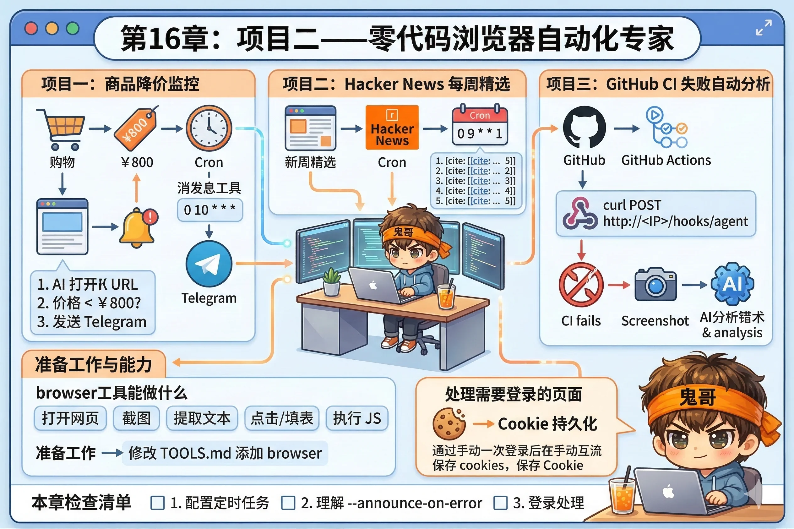

# 第16章：项目二——零代码浏览器自动化专家

每个人的收藏夹里，都躺着一批"需要定期去看一眼"的网页。

某件商品什么时候降价？竞品有没有更新定价？招聘网站有没有新坑位？技术论坛今天有没有值得读的文章？

以前你只有两个选择：要么自己每天手动打开，要么花时间写爬虫脚本。现在有第三个选择：**让 AI 开着浏览器替你盯着，有动静才叫你**。

这一章，我们用三个真实任务，把 `browser` 工具和 Cron + Webhook 组合起来，搭出一套零代码浏览器自动化监控系统。



---

## browser 工具能做什么

在开始之前，快速回顾一下 `browser` 工具的核心能力（第8章详细讲过，这里只列项目里会用到的）：

| 能力 | 说明 |
|---|---|
| 打开网页 | 加载任意 URL，等待页面渲染完成 |
| 截图 | 截取当前页面或指定区域 |
| 提取文本 | 读取页面上指定元素的文本内容 |
| 点击/填表 | 模拟用户操作，支持登录等交互 |
| 执行 JS | 在页面上下文里执行 JavaScript |

关键一点：**AI 不是用正则表达式解析 HTML，而是真的"看"着渲染好的页面**——就像你眼睛看网页一样。这意味着即使网站没有 API，AI 也能从视觉上理解页面内容。

---

## 准备工作：启用 browser 工具

确认你的 Workspace 里的 `TOOLS.md` 启用了 `browser`：

```markdown
# 工具配置

工具画像：minimal

## 额外启用

- browser
```

或者直接用 `coding` 或 `full` 画像，它们默认包含 `browser`。

---

## 任务一：商品降价监控

**目标**：每天检查某商品的价格，如果比目标价低，立刻发 Telegram 通知。

### 配置 Cron 任务

```bash
openclaw cron add \
  --name "耳机降价监控" \
  --cron "0 10 * * *" \
  --timezone "Asia/Shanghai" \
  --session isolated \
  --message "请完成以下任务：
1. 打开 https://www.amazon.cn/dp/B09XS7JWHH（替换为你要监控的商品链接）
2. 找到当前售价
3. 如果价格低于 ¥800，立刻通过 messaging 工具发 Telegram 消息给我，内容包含当前价格和商品链接
4. 如果价格高于或等于 ¥800，不要发任何消息，静默结束" \
  --announce-on-error \
  --channel telegram
```

注意这里没有用 `--announce`，而是用了 `--announce-on-error`——任务出错时才通知，正常执行不打扰你。降价通知是在 `message` 里让 AI 用 `messaging` 工具主动发的，只在真的降价时才发。

### 测试

手动触发一次，看 AI 是否能正确读取页面价格：

```bash
openclaw cron run --id <job-id>
openclaw cron runs --id <job-id> --limit 1
```

查看运行日志，确认 AI 找到了价格，并根据条件判断是否发送通知。

---

## 任务二：Hacker News 每周精选

**目标**：每周一早上，抓取 Hacker News 头版，摘要最值得读的 5 篇文章，推送到 Telegram。

这是一个纯内容聚合任务，不需要任何 API Key，完全靠 browser 工具读取公开页面。

```bash
openclaw cron add \
  --name "HN 周报" \
  --cron "0 9 * * 1" \
  --timezone "Asia/Shanghai" \
  --session isolated \
  --message "请完成以下任务：
1. 打开 https://news.ycombinator.com
2. 读取首页所有文章标题、链接和分数
3. 从中筛选分数最高的 5 篇（排除招聘帖和 Ask HN）
4. 对每篇文章，打开链接，读取正文摘要（50字以内）
5. 整理成简洁的 Markdown 列表，格式如下：
   ### HN 本周精选（日期）
   1. [标题](链接) — 一句话摘要
   2. ...
6. 发送到 Telegram" \
  --announce \
  --channel telegram
```

::: tip 让 AI 自己判断要不要读全文
步骤4里让 AI 读每篇文章的正文——如果有些链接打不开（付费墙、超时），AI 会自动跳过并用标题替代摘要，不会卡死在那里。这是用自然语言指令的好处：不需要写异常处理逻辑。
:::

---

## 任务三：GitHub CI 失败自动分析

**目标**：当 GitHub Actions 构建失败时，Webhook 触发 AI 自动打开 CI 页面，截图并分析错误原因，把结论推送到 Telegram。

这个任务把 Webhook（第12章）和 browser 工具结合起来。

### 第一步：在 openclaw.json 里配置 Webhook

```json
{
  "hooks": {
    "enabled": true,
    "token": "your-webhook-token",
    "mappings": {
      "github-ci-failed": {
        "kind": "agentTurn",
        "channel": "telegram",
        "messageTemplate": "GitHub CI 构建失败了。\n失败的 workflow URL：{{run_url}}\n\n请完成以下任务：\n1. 打开上面的 URL\n2. 截取页面截图\n3. 找到失败的 step 和错误信息\n4. 用简洁的语言解释是什么错误，给出可能的修复方向\n5. 把截图和分析结果发给我"
      }
    }
  }
}
```

### 第二步：在 GitHub 仓库里设置 Webhook

在 GitHub 仓库 → Settings → Webhooks → Add webhook：

```
Payload URL: http://<你的公网IP或Tailscale地址>:18789/hooks/github-ci-failed
Content type: application/json
Secret: （留空，认证在请求头里）
Events: Workflow runs
```

等等，GitHub 原生 Webhook 的请求头格式和 OpenClaw 预期的不完全一致。更简单的方案是用 GitHub Actions 里的 `curl` 步骤主动推送：

```yaml
# .github/workflows/notify-failure.yml
name: Notify on Failure

on:
  workflow_run:
    workflows: ["CI"]
    types: [completed]

jobs:
  notify:
    if: ${{ github.event.workflow_run.conclusion == 'failure' }}
    runs-on: ubuntu-latest
    steps:
      - name: Notify OpenClaw
        run: |
          curl -X POST http://${{ secrets.OPENCLAW_HOST }}/hooks/agent \
            -H "Authorization: Bearer ${{ secrets.OPENCLAW_TOKEN }}" \
            -H "Content-Type: application/json" \
            -d '{
              "message": "GitHub CI 构建失败。失败链接：${{ github.event.workflow_run.html_url }}\n\n请打开这个链接，截图并分析失败原因，用中文告诉我哪一步失败了以及可能的原因。",
              "channel": "telegram",
              "name": "ci-failure-analysis"
            }'
```

把 `OPENCLAW_HOST`（你的 Tailscale 地址）和 `OPENCLAW_TOKEN` 添加到仓库的 Secrets 里，就配好了。

### 测试

故意让一个 CI 构建失败（比如在代码里引入一个语法错误并推送），观察几分钟后 Telegram 是否收到了带有截图和分析的消息。

---

## 处理需要登录的页面

有些监控任务需要登录——比如监控内网系统、需要账号的平台。

OpenClaw 的 browser 工具支持**保存和复用 cookie**：

```markdown
# TOOLS.md

## Browser 配置

会话持久化：enabled
Cookie 存储路径：~/.openclaw/browser-sessions/
```

第一次使用时，让 AI 执行登录操作：

```
请打开 https://example-internal-system.com，用用户名 myuser、密码 [密码] 登录，
登录成功后保存 cookie，之后就不需要再登录了
```

之后的 Cron 任务里，AI 会自动复用保存的 cookie，无需每次重新登录。

::: warning 密码安全
不要把密码直接写在 Cron 任务的 `message` 里——那会被记录到日志。正确做法是先手动执行一次登录操作（一次性交互），保存 cookie，之后的自动化任务复用 cookie，完全不需要密码。
:::

---

## 完整配置汇总

三个任务都配置好后，`openclaw cron list` 应该显示：

```
ID        名称              状态    下次运行
job-001   耳机降价监控      active  明天 10:00
job-002   HN 周报           active  下周一 09:00
job-003   （CI 由 Webhook 触发，无固定计划）
```

---

## 本章小结

这三个任务背后的模式是一样的：

```
触发（Cron 或 Webhook）
  → AI 开浏览器执行任务
  → 判断是否需要通知
  → 只在有价值时推送
```

传统爬虫需要你了解 CSS 选择器、处理各种异常、维护脆弱的正则表达式。这套方案的核心是**用自然语言描述任务**，AI 自己决定怎么操作浏览器——网站改版了不需要你改代码，AI 会适应新的页面结构。

代价是速度略慢、成本略高（AI 需要真正渲染和理解页面）。但对于每天跑几次的监控任务来说，这个代价完全值得。

---

::: tip 本章检查清单
- [ ] 你成功配置了至少一个定时浏览器监控任务，并手动触发验证它能读取页面内容了吗？
- [ ] 你理解为什么这里用 `--announce-on-error` 而不是 `--announce` 了吗？
- [ ] 你知道如何处理需要登录的页面（cookie 持久化）了吗？
:::
