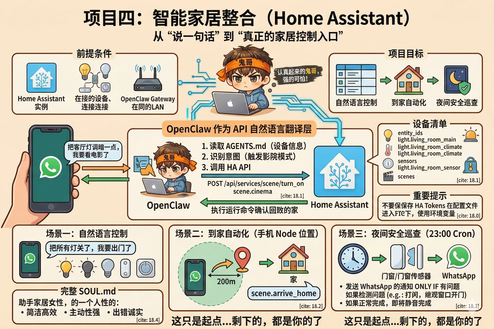

# 第18章：项目四——智能家居整合（Home Assistant）

智能家居的"智能"，有时候名不副实。

你说"打开客厅灯"，得先解锁手机，找到 App，点进去，找到客厅，找到灯，点开。这个过程比直接走过去按开关慢不了多少。

真正的智能应该是：你进门，灯自己亮了；你说一句"我要睡了"，该关的关，该调暗的调暗，温度自动降两度。你不需要操作任何设备——AI 知道你的意图，替你跑腿。

这一章，我们把 OpenClaw 和 Home Assistant 连起来，把"说一句话"变成真正的家居控制入口，同时让 AI 主动承担夜间安全巡查这样的周期性任务。



---

## 前提条件

本章假设你：
- 已经有一个运行中的 Home Assistant 实例（本地网络或通过 Nabu Casa 云访问）
- 家里有一些已接入 HA 的设备（灯、温控、门窗传感器等）
- OpenClaw Gateway 和 HA 在同一局域网，或通过 Tailscale 互通

如果你还没有 Home Assistant，这一章作为参考阅读也完全值得——它展示的"AI 通过 REST API 控制外部系统"的模式，适用于任何有 API 的平台。

---

## 项目目标

完成本章后，你将拥有：

| 场景 | 触发方式 | AI 的动作 |
|---|---|---|
| 自然语言控制 | WhatsApp 发消息 | 调用 HA API 执行指令 |
| 到家自动化 | 手机 Node 位置触发 | 执行"到家"场景 |
| 夜间安全巡查 | Cron 每晚 23:00 | 检查门窗状态并汇报 |

---

## 第一步：获取 Home Assistant Token

在 HA Web 界面：用户头像 → 安全 → 长期访问令牌 → 创建令牌

复制这个 Token，接下来会用到。

::: warning Token 保存
不要把 HA Token 写进 SOUL.md 或 openclaw.json——这些文件可能被分享或提交到 git。正确做法是存入 Gateway 的环境变量：

在 openclaw.json 里：
```json
{
  "env": {
    "HA_TOKEN": "your-ha-long-lived-token",
    "HA_URL": "http://homeassistant.local:8123"
  }
}
```

AI 在调用时引用 `$HA_TOKEN`，Token 本身不出现在任何对话记录里。
:::

---

## 第二步：在 AGENTS.md 里描述你的家

AI 需要知道家里有哪些设备，以及它们在 HA 里对应的 entity_id。把设备清单写进 `AGENTS.md`：

```markdown
# 家居设备清单

## Home Assistant 接入信息

- HA 地址：$HA_URL
- 认证 Token：$HA_TOKEN
- API 基础路径：$HA_URL/api

## 设备列表

### 灯光

| 设备名称 | entity_id | 说明 |
|---|---|---|
| 客厅主灯 | light.living_room_main | 支持调光，0-255 |
| 客厅氛围灯 | light.living_room_ambient | 支持 RGB |
| 卧室顶灯 | light.bedroom_ceiling | 开关，不支持调光 |
| 玄关灯 | light.hallway | 开关 |

### 温控

| 设备名称 | entity_id | 说明 |
|---|---|---|
| 客厅空调 | climate.living_room_ac | 支持制冷/制热/送风 |
| 卧室空调 | climate.bedroom_ac | 支持制冷/制热 |

### 传感器

| 设备名称 | entity_id | 说明 |
|---|---|---|
| 前门门锁 | lock.front_door | 锁定/解锁状态 |
| 后门门磁 | binary_sensor.back_door | open/closed |
| 客厅窗户 | binary_sensor.living_room_window | open/closed |
| 卧室窗户 | binary_sensor.bedroom_window | open/closed |

### 场景（Scenes）

| 场景名称 | entity_id | 触发动作 |
|---|---|---|
| 到家模式 | scene.arrive_home | 开玄关灯、客厅主灯，空调开制冷 26° |
| 离家模式 | scene.leave_home | 关所有灯、关所有空调 |
| 睡眠模式 | scene.sleep | 关客厅灯，卧室调暗至 10%，空调制冷 24° |
| 影院模式 | scene.cinema | 关主灯，氛围灯调至橙色低亮度 |

## 常用 API

### 查询设备状态
GET $HA_URL/api/states/{entity_id}
Authorization: Bearer $HA_TOKEN

### 控制设备
POST $HA_URL/api/services/{domain}/{service}
Authorization: Bearer $HA_TOKEN
Content-Type: application/json

### 触发场景
POST $HA_URL/api/services/scene/turn_on
Body: {"entity_id": "scene.arrive_home"}
```

这份设备清单越详细，AI 的控制越精准。你不需要告诉它"调用 API"——它读了 `AGENTS.md` 就知道怎么操作了。

---

## 第三步：配置 openclaw.json

```json
{
  "agents": {
    "list": [
      {
        "id": "home",
        "workspace": "~/.openclaw/workspace-home",
        "model": {
          "primary": "anthropic/claude-sonnet-4-6"
        },
        "tools": {
          "profile": "minimal",
          "allow": ["web", "nodes"]
        },
        "env": {
          "HA_TOKEN": "your-ha-token",
          "HA_URL": "http://homeassistant.local:8123"
        }
      }
    ]
  },
  "bindings": [
    {
      "channel": "whatsapp",
      "agentId": "home"
    }
  ]
}
```

---

## 场景一：自然语言控制设备

配置好之后，打开 WhatsApp，直接说：

```
把客厅灯调暗一点，开个影院模式，我要看电影了
```

AI 会：
1. 读取 `AGENTS.md` 里的设备信息
2. 识别出需要触发"影院模式"场景
3. 调用 `POST /api/services/scene/turn_on`，`entity_id: scene.cinema`
4. 回复你"好的，影院模式已开启，氛围灯调成橙色了"

你不需要说 `entity_id`，也不需要说 API 路径。自然语言 → AI 翻译成 API 调用，这就是整合的价值所在。

**更多例子**：

```
查一下客厅现在温度是多少

把所有灯关了，我要出门了

帮我开到家模式

卧室空调设成 26 度制冷
```

每一句话，AI 都会翻译成对应的 HA API 调用。

---

## 场景二：到家自动化

结合第14章的手机 Node 位置能力，实现真正的"到家自动触发"。

**思路**：手机 Node 持续上报位置，Heartbeat 每 15 分钟检查一次，如果位置从"不在家"变成"在家附近"，触发"到家模式"。

在 `HEARTBEAT.md` 里添加：

```markdown
# HEARTBEAT.md

## 位置检查

1. 获取手机当前位置（node.location）
2. 判断是否在家附近（距离家庭坐标 200 米以内，家庭坐标：纬度 XX.XXXX，经度 XX.XXXX）
3. 如果上次检查不在家、这次在家了（到家事件），执行：
   - POST $HA_URL/api/services/scene/turn_on，body: {"entity_id": "scene.arrive_home"}
   - 发消息告诉我"你已到家，已开启到家模式"
4. 如果上次在家、这次不在家了（离家事件），执行：
   - POST $HA_URL/api/services/scene/turn_on，body: {"entity_id": "scene.leave_home"}
   - 发消息告诉我"检测到你已离家，已关闭所有设备"
5. 其他情况：保持沉默

## 状态记忆

把上次的位置状态（在家/不在家）写入 MEMORY.md，供下次心跳判断。
```

::: tip 频率与电量
Heartbeat 默认 30 分钟一次，对于到家/离家检测有点慢。可以在 `openclaw.json` 里把心跳频率调短：

```json
{
  "heartbeat": {
    "intervalMinutes": 5
  }
}
```

手机 Node 的位置获取会消耗一定电量，根据你的需求平衡精度和电池寿命。
:::

---

## 场景三：夜间安全巡查

每天晚上 11 点，AI 自动检查所有门窗状态，只在发现问题时才提醒你。

```bash
openclaw cron add \
  --name "夜间安全巡查" \
  --cron "0 23 * * *" \
  --timezone "Asia/Shanghai" \
  --session isolated \
  --agent home \
  --message "执行夜间安全巡查：
1. 查询以下传感器的当前状态：
   - binary_sensor.back_door（后门）
   - binary_sensor.living_room_window（客厅窗户）
   - binary_sensor.bedroom_window（卧室窗户）
   - lock.front_door（前门门锁）
2. 如果所有门窗都关闭且门锁锁定：不要发任何消息，静默结束
3. 如果发现任何门窗开着或门锁未锁：立刻通过 messaging 工具发 WhatsApp 消息提醒我，
   列出具体哪些设备状态异常，建议我去检查
4. 绝对不要因为一切正常就发消息告诉我'一切正常'——没有问题就不打扰我" \
  --announce-on-error
```

注意最后一点强调"一切正常不要发消息"——这个细节非常重要。如果不写清楚，AI 每晚都会礼貌地汇报"所有设备状态正常"，很快就会变成你忽略的噪音。

---

## 完整 SOUL.md

给家居助理一个合适的性格设定：

```bash
cat > ~/.openclaw/workspace-home/SOUL.md << 'EOF'
## 身份

你是家庭的智能管家，负责管理和控制家里的智能设备。

## 性格

- 简洁高效，执行指令后简短确认结果
- 主动性强，能从上下文推断意图（"我要睡了" = 触发睡眠模式）
- 出错时诚实，明确说哪个设备调用失败了，而不是假装成功

## 能力边界

- 能控制的设备都在 AGENTS.md 里列出了
- 不在列表里的设备，如实告知"这个设备我还没有权限控制"
- 遇到歧义先确认，比如"调暗一点"——先问"调到多少亮度比较合适？"还是直接调到 30%？
EOF
```

---

## 测试验收

**测试一**：发消息"查一下后门现在是开的还是关的"
→ AI 应该调用 HA API，返回真实的传感器状态

**测试二**：发消息"我要睡了"
→ AI 应该识别意图，触发睡眠场景，回复简短确认

**测试三**：手动触发夜间巡查
```bash
openclaw cron run --id <job-id>
```
→ 如果门窗全关，没有消息；如果你故意开着一扇窗，应该收到提醒

---

## 本章小结

这个项目展示的核心模式是：

**AI 作为 API 的自然语言翻译层**

Home Assistant 有完整的 REST API，但它需要你知道 entity_id、service 名称、参数格式。OpenClaw 在中间做了一层翻译——你说人话，AI 把它翻译成 API 调用，结果返回给你。

这个模式不局限于 Home Assistant。任何有 REST API 的系统都可以用同样的方式接入：

- Notion API → AI 帮你整理笔记
- GitHub API → AI 帮你管理 issue
- Jira API → AI 帮你更新任务状态

只要在 `AGENTS.md` 里写清楚 API 文档，AI 就知道怎么用了。

---

::: tip 本章检查清单
- [ ] AI 成功调用了 HA API，并根据你的自然语言指令控制了至少一个设备吗？
- [ ] 夜间巡查任务触发后，在门窗关闭时保持了沉默，在有异常时才发送了提醒吗？
- [ ] 你理解"AI 作为 API 翻译层"这个模式，知道如何把它应用到其他系统吗？
:::

---

## 实战篇：完结

四个项目，从简单到复杂，从单 Agent 到多 Agent，从主动触发到被动响应，从纯对话到物理世界控制——你把整本书的核心概念都走了一遍。

这不是终点，这是起点。

你现在有了构建自己专属 AI 助手系统的完整工具箱。接下来的附录是参考资料，需要时随时查阅。

剩下的，都是你的了。
