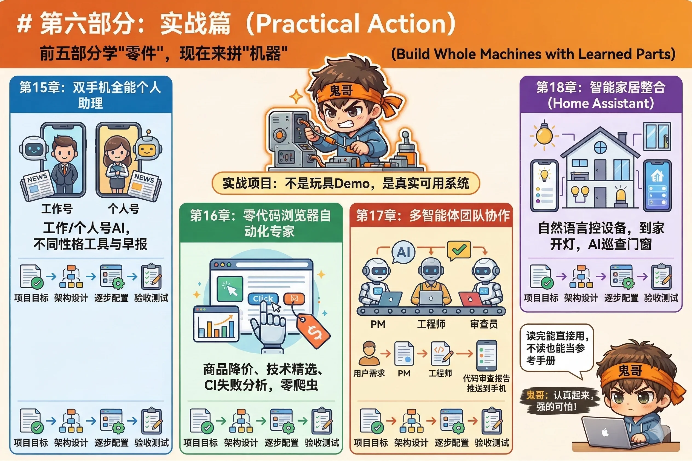

# 第六部分：实战篇

前五部分，你学的是"零件"。

这一部分，我们来拼整台机器。

---

实战篇的四个项目，每一个都是真实可用的系统——不是玩具 demo，不是"你可以想象有这么个东西"，而是跑起来之后每天真正帮你干活的那种。

**本部分包含四章：**

- **第15章** 打造"双手机"全能个人助理——工作号和个人号背后各跑一个 AI，性格不同、工具不同、早报不同，从零配置到完整跑通。

- **第16章** 零代码浏览器自动化专家——商品降价了发通知、技术论坛每周精选、CI 失败自动截图分析，不写一行爬虫代码。

- **第17章** 多智能体团队协作——PM、工程师、审查员三个 AI 角色组成流水线，你发一句需求，它们自动接力，最后把代码审查报告推到你手机上。

- **第18章** 智能家居整合（Home Assistant）——用自然语言控制家里的设备，到家自动开灯，每晚 11 点 AI 替你巡查门窗。

---

每章都遵循同一个结构：**项目目标 → 架构设计 → 逐步配置 → 验收测试**。

读完能直接用，不读也能回来当参考手册查。
